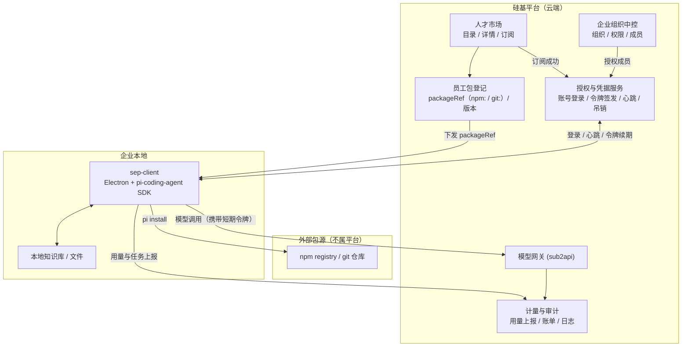

# 硅基员工平台 —— 方向调整设计方案 v3

## 1. 文档说明

本文承接 `硅基员工平台设计方案.md`（2026-07-27 会议提炼版，下称「总体方案」），
针对一处**关键实现方式变更**给出落地设计：

> 硅基员工不再以「平台内对话」的方式交付，而是**订阅后下载到本地运行**
> （客户端 / 安装包 / zip 等形态），使用方式以**配置驱动**为主，对话为辅。

这一变更改变了平台的技术边界：**平台从「运行时」退回到「分发与授权层」**。
本文说明由此产生的架构、对象模型、接口和阶段划分调整。

会议中未确认的价格、协议与远期设想不作为既定结论。术语沿用总体方案：
**碳基员工**＝企业中的人类成员；**硅基员工**＝可承担具体工作的 AI 员工。

### 1.1 v3.1 修订（2026-07-29）—— 客户端技术路线落定

本文初版把「统一客户端」留作待确认项（原 §8.3 问题 1、2）。现已确认技术路线：
以开源 agent 运行时 **[pi](https://github.com/earendil-works/pi)**（MIT）为底座，
用 **Electron** 做壳，作为**独立仓库 `sep-client`** 二次开发。由此产生五项决策：

| # | 决策 | 影响本文位置 |
|---|---|---|
| 1 | 壳技术选型 = **Electron**（主进程 Node.js），`pi-coding-agent` SDK **进程内直接调用**；RPC/sidecar 模式保留作降级备选 | §8.3 问题 1 已关闭、§10 阶段九解锁 |
| 2 | 员工包清单格式 **暂缓**；MVP 只在 pi 自带包元数据里加最小 `sep` 字段（`templateId` / `allowedTools` / `localPermissions`） | §8.3 问题 2 降级为暂缓、§6 |
| 3 | 客户端首次使用改为**账号登录**（不再输激活码）；保留设备指纹与可吊销设备记录；激活码降级为 IT 批量部署的备用通道 | §4.2、§4.3 流程图、§7 |
| 4 | 本地权限强度 = **工具白名单 + GUI 批准弹窗**；不做容器化隔离（列为可选加固） | §6 |
| 5 | 员工包分发**复用 pi 自己的 package 机制**（`npm:` / `git:`，可锁 tag/commit）；平台只记录 `packageRef`，不自建制品仓库、不发下载令牌、不做 SHA-256 校验 | §4.1、§7、§10 阶段五 |

**一个重要的连带结论**：客户端的模型调用全部经过平台网关
（§5.2），因此「平台失去计量数据源」这一顾虑被推翻 ——
网关重新成为唯一计量入口。`docs/plans/项目升级开发顺序方案v3.md` §0
的前提描述据此修订。

完整的客户端设计、接口清单、权限模型与 PoC 计划见
`docs/对接/SEP客户端-项目交接文档.md`。本文以下正文已按上述决策就地修订，
被替换的旧方案以「~~删除线~~」或「原方案」标注保留，便于回溯。

---

## 2. 核心变更：平台不再是运行时

### 2.1 变更前后对比

| 维度 | 变更前（现有实现） | 变更后（本方案） |
|---|---|---|
| 员工存在形式 | 平台内的一条配置记录 | **可安装的员工包**（pi package，`npm:` / `git:`），由统一客户端加载 |
| 执行位置 | 平台服务端 | **用户本地** |
| 交互方式 | 聊天对话（SSE 流式）| **配置表单驱动**，对话为可选补充 |
| 平台职责 | 承载对话、编排工具、调模型 | **订阅、授权、分发、计量、审计** |
| 员工与平台关系 | 员工是平台的一个功能 | 员工是**独立项目**，平台是其分发渠道 |

### 2.2 这意味着什么

**平台的核心资产变成三样**：员工目录（卖什么）、订阅授权（谁能用）、
使用凭据与计量（用了多少）。执行本身移出平台。

**一个必须正视的推论**：代码一旦下载到用户本地，平台就**失去了执行过程的
强控制权**。总体方案 §4.4「统一适配与连接层」和 §7.8「审计与安全」原本
假设执行发生在平台侧；本地执行后，这两项能力必须改为**由客户端主动上报 +
平台校验凭据**的模式，且要接受「客户端可能被篡改」这一前提。

设计上不追求"防住恶意用户"（本地代码理论上都可绕过），而是做到：
- 未授权无法获得可用凭据 → 拿不到模型能力，员工是个空壳
- 正常使用路径下，用量与审计数据完整可信
- 凭据可吊销，越权可被发现

---

## 3. 总体架构（调整版）



平台**不经手员工包字节流** —— 只下发 `packageRef`，实际拉取由 `pi install`
直接对 npm registry / git 仓库发起（决策 5）。

### 3.1 与总体方案的对应关系

| 总体方案模块 | 本方案落点 | 变化 |
|---|---|---|
| §4.1 人才市场 | 人才市场 | 不变，仍是核心入口 |
| §4.2 企业组织中控 | 企业组织中控 | 不变，仍需完整建设 |
| §4.3 员工运行环境 | **`sep-client`（独立项目，Electron + pi-coding-agent SDK）** | **移出平台**，平台只负责登记 `packageRef` 与授权 |
| §4.4 统一适配连接层 | **下沉到客户端内部** | 平台侧不再自定义清单规范，沿用 pi 的 package 约定（决策 5） |
| §4.5 基础支撑 | 模型网关 / 计量 / 审计 | 保留且**本期即启用** —— `sep-client` 所有模型调用经 SEP 网关，计量有真实数据源 |

**§4.4 的重新定位**（回应会议纪要第 91 条）：适配器不废弃，但**服务对象变了** ——
从"平台运行时调用外部能力"变为"**员工客户端内部**接入 Coze / n8n / RPA 等能力"。
现有 `CapabilityAdapter.execute()` 抽象仍成立，只是运行位置从平台移到客户端；
平台侧保留其作为**员工打包规范的一部分**（员工声明自己需要哪些外部平台凭据）。

---

## 4. 对象模型调整

### 4.1 新增：员工包（EmployeePackage）

「可分发」这件事需要一个明确的对象承载。因已确认走**统一客户端**路线
（§8 决策 1），员工包是**被壳加载的单元**，而非独立可执行程序。

**决策 5 已确认：复用 pi 自己的 package 机制**（`npm:` / `git:`，可锁 tag/commit）。
平台不自建制品仓库，不发下载令牌，不做 SHA-256 校验 ——
包的完整性由 npm integrity / git commit hash 保证。

平台只记录 `packageRef`：

- 包 ID、所属员工模板、版本号；
- 形态：`packageRef: { type: "npm" | "git", spec: "@sep/employee-xxx@1.0.0" }`（§8 决策 2 暂缓，MVP 只做最小 `sep` 字段）；
- 最低客户端协议版本（壳据此判断能否加载）；
- 清单文件（见 §6）；
- 发布状态与发布时间。

~~`ZIP` 形态、文件地址、大小、SHA-256 校验和~~ —— 不再需要，npm/git 层已提供完整性保证。

### 4.2 新增：员工实例与凭据

总体方案 §6.4 已要求「模板」与「企业实例」分离。本方案在实例上追加**激活**语义。

**员工实例（EmployeeInstance）**
- 所属企业、来源模板、模板版本；
- 企业内自定义名称（如「视频工程师」）、所属部门、负责人；
- 配置：启用哪些知识库、模型路由、初始化资料、计划任务；
- 状态：`PENDING_ACTIVATION` / `ACTIVE` / `SUSPENDED` / `REVOKED`。

> ⚠️ **同一企业可有多个实例来自同一模板**（§8 决策 8），
> 因此**不能**用 `@@unique([enterpriseId, templateId])` 约束。
> 实例靠自身 ID 标识，企业内名称建议在企业范围内唯一以避免混淆。

**版本升级采用「提示式」**（§8 决策 14）：实例记录**订阅时锁定的模板版本**，
模板发新版后不自动跟进，仅在企业管理台显示升级提示，由企业主动确认。

这样做的前提是实例必须存 `templateVersion` 而非只存 `templateId` ——
否则无法判断"当前用的是哪版、有没有新版"。升级动作＝更换该字段
并重新安装对应版本的 pi package。

> 配置兼容性风险：新版若增删了配置项，旧配置可能不适用。
> MVP 阶段建议升级提示里直接告知"需重新检查配置"，
> 不做自动迁移（自动迁移需要清单声明配置项的版本演进规则，成本高）。

**凭据分两层**（因统一客户端，登录发生在「壳」这一层）：

**客户端登录凭据（ClientCredential）** —— 绑定企业 + 运行环境
- ~~激活码~~ → **账号登录**（决策 3）：用户首次启动壳时用平台账号密码登录；
- 运行环境指纹：首次登录时登记，用于识别换机；
- 刷新令牌 + 短期访问令牌；
- 有效期（**可配置**，§8 决策 5）、最近心跳时间、吊销状态。

**实例访问权（运行期动态解析）**
- 壳登录后，凭企业级凭据拉取「本企业已订阅、且当前用户被授权」的实例清单；
- 实例的启停不需重新登录客户端，下次心跳即生效。

**为什么这样分层**：GUI 本身就是一个自然的登录入口，激活码的存在是为了弥补
CLI/ZIP 形态没有好登录 UX 的缺失；有了桌面 GUI，直接账号登录更简单、更安全。
实际调用用**短期令牌**，吊销才有意义 —— 企业停用实例或回收成员权限后
（总体方案 §12 验收标准第 8 条），令牌到期即失效，不依赖客户端自觉。
把登录放在壳这一层，则新订阅一个员工无需重新登录，符合"一个壳装多个员工"。

**激活码降级为备用通道**（IT 统一批量部署场景），非主路径。
v3 P3.4 本来就写了激活凭据 MVP 可选，此改动不与已有决策冲突。

### 4.3 新增：企业组织层（总体方案 §11 第一阶段）

这部分现有代码**完全缺失**，且是其余一切的前提：

- **企业（Enterprise）**：数据与权限的隔离边界；套餐、算力账户挂在此层。
  **自助注册**（§8 决策 11）：注册流程尽量简单 —— 建议「注册账号时填公司名
  → 自动创建企业 → 注册人即首个企业管理员」三步内完成，
  不做资质审核、不做邀请码，后续需要再加；
- **部门（Department）**：支持树形结构；
- **企业成员（EnterpriseMember）**：`User` × `Enterprise` 的关联，
  承载企业内角色（管理员 / 部门负责人 / 普通成员）与所属部门；
- **员工授权（EmployeeGrant）**：某实例授权给哪些部门或成员；
- **跨部门调用申请（AccessRequest）**：申请、审批、限时授权、到期回收。

> ⚠️ **现有模型是单用户视角，与「以组织为核心」冲突，需改造主体**：
> ```
> Subscription        userId → enterpriseId
> ComputeAccount      userId → enterpriseId   // 套餐含算力额度，应挂企业
> ```
> 这是数据模型重构，不是加表。

### 4.4 任务：⏸️ 本期不做（见 §8.0）

总体方案 §6.5 定义的是**任务（Task）**，没有"会话"。

但**已确认 MVP 阶段任务全部在客户端本地发起、结果暂不上报**（§8 决策 15），
平台因此看不到任务的存在，`Task` 表本期**不建**。

平台侧仍能看到**算力用量**，因为模型调用经平台网关（§5.2），
token 在网关层被记录。维度是「企业 / 实例 / 模型」而非「任务」。

将来需要任务可见性时：新建 `Task` 表 + 打开客户端上报即可。
现有 `ConversationSession` + `Message` + `ToolExecution` 三张表的字段与
任务高度重叠，可作改造基础，但语义需从"一次对话"换为"一次任务执行"。

---

## 5. 关键流程

### 5.1 订阅 → 安装 → 登录 → 工作


对照总体方案 §7.3 的招聘入职流程，本方案把「绑定运行环境」具体化为
**账号登录 → 指纹登记 → pi 安装员工包**三步（决策 3、5）。
~~下载 → 安装 → 激活码激活 → 指纹登记~~

### 5.2 本地执行时的模型调用与计量

这是本方案**最关键的技术决策点**：

```
客户端需要调模型
  → 携带短期令牌请求平台模型网关（不是直连上游）
  → 平台校验：令牌有效？实例状态 ACTIVE？企业算力余额充足？
  → 通过则代理转发至 sub2api，返回结果
  → 平台侧记录 token 用量并扣减企业算力
```

**为什么不把上游 API Key 下发给客户端**：一旦下发，凭据即泄漏，用量无法
归属，额度无法控制，吊销也失效。让客户端**始终经平台网关调模型**，
才能同时满足计量（总体方案 §7.7）、审计（§7.8）和额度控制。

代价是客户端必须联网 —— **已确认接受**（§8 决策 3），不支持离线。
因此客户端应在启动时即校验凭据，网络不可用时明确提示不可用，
而非静默降级；心跳连续失败超阈值则进入锁定状态。

**平台现有实现可直接复用**：`sub2api` 接入、`MODEL_PRICING` 价格表、
保底计费（未配价模型按最贵档收费）、汇率可配置、`ComputeTransaction` 记账 ——
这些都已验证可用，只需把调用方从"平台内对话服务"换成"客户端网关"。

### 5.3 权限回收与吊销

企业停用员工或回收成员权限后：

1. 实例状态置 `SUSPENDED` / `REVOKED`；
2. 相关凭据标记吊销，拒绝续期；
3. 客户端下次心跳或换令牌时被拒，进入不可用状态；
4. 已下发的短期令牌在有效期内仍可用 —— **这是设计取舍**：
   令牌有效期越短，吊销越及时，但心跳越频繁。建议短期令牌有效期
   控制在分钟级到小时级，具体值待定。

---

## 6. 员工制品规范（新增，平台侧核心资产）

员工是独立项目，但要能被平台分发与管理，必须遵守统一规范。
每个制品需包含一份**清单文件**，声明：

- 员工身份：模板 ID、版本、名称、图标；
- **配置模式定义**：需要用户填哪些配置项（类型、必填、校验规则、
  默认值、分组）—— 这是「配置化使用」的基础，平台据此可在
  Web 端预览配置项，客户端据此渲染表单；
- 能力边界：能做什么、不能做什么、输入输出形式；
- 依赖声明：需要哪些模型、外部平台凭据（Coze/n8n 等）、本地权限
  （文件读写、网络、剪贴板等）；
- 上报契约：任务与用量上报的字段；
- 最低平台协议版本。

**审核依据**（总体方案 §7.1）：平台按此清单校验制品能否运行、
声明的权限是否合理、是否存在越权访问。

> 清单的具体格式（JSON Schema / YAML）和 SDK 形态待定，见 §8。

---

## 7. MVP 范围调整

### 7.1 本期必须完成

**企业组织层**（当前完全缺失，最高优先）
- 企业、部门、成员、企业内角色；
- 成员与员工实例的授权关系；
- `Subscription` / `ComputeAccount` 主体改为企业。

**人才市场**
- 员工目录：分类、搜索、筛选；
- 员工详情：按总体方案 §7.1 的「我是谁 / 我能做什么 / 如何使用 /
  做得怎么样 / 如何获得」五段式组织；
- 订阅/招聘 → 生成企业实例。

**分发与激活**（本方案新增核心，决策 3、5 已更新）
- 员工包 `packageRef` 管理（`npm:` / `git:` 格式，锁 tag/commit）；
- ~~带时效的下载令牌~~ → 不再需要，包完整性由 npm integrity / git commit hash 保证；
- ~~激活码签发与客户端激活接口~~ → 改为 `/client/login`（账号登录）+ `/client/token`（按实例签发短期令牌）；
- 实例清单与配置下发接口（壳登录后按授权拉取）。

**前端：单应用 + 三块功能域路由分组**（§8.2）
- `(market)` 市场：公开可浏览、订阅需登录、详情五段式；
- `(enterprise)` 企业管理台：**全新**，组织/成员/实例/授权/算力；
- `(platform)` 运营端：模板/版本/员工包管理 + 上架审核 + 企业列表。

**本地执行支撑**
- 客户端模型调用网关（校验凭据 + 代理转发 + 计量）；
- 心跳与令牌续期；
- 上报接口**预留**但不实现（§8.0）。

**计量**
- 沿用现有 token 计量、保底计费、汇率配置（均已验证）；
- 用量维度：企业 / 实例 / 模型（**非任务维度**，见 §8.0）。

**员工侧**
- **1 个真实可安装、能干活的员工**（由 `sep-client` 加载）：
  交付物 = **pi package（`npm:` / `git:` 格式）+ 一份使用说明**（§8 决策 5、12），
  说明书告诉用户如何安装 `sep-client`、账号登录、`pi install` 安装员工包、配置、运行。

### 7.2 本期不做

- 会话/聊天形态（现有 SSE 实现保留代码，不作为交付形态）；
- 多员工自动编排、指挥官自动拆解（总体方案 §8.3 亦列为后续）；
- 跨企业 MCP/Agent 协商；
- 大规模连接器生态；
- **离线运行模式**（已确认必须联网）；
- **桌面客户端壳**（`sep-client`）—— MVP 实现 Electron + 进程内 `pi-coding-agent` SDK；
  完整功能逐步实现（§8 决策 1）；
- `INSTALLER` / `DOCKER` 等其他制品形态；
- 完整商业套餐与复杂计费规则；
- **`Task` 对象与任务上报**（§8 决策 15，§8.0 详述）；
- **计划任务 / 平台派发任务**（需客户端拉取机制）；
- **算力硬限制的预扣机制**（已确认硬限制，但非优先级，
  MVP 可先做"余额不足则拒绝"的简单校验，不做并发预扣防超卖）；
- **员工包内敏感凭据的托管方案**（§8 决策 16，暂不处理）；
- 完整审计日志（依赖任务上报，一并推迟）。

---

## 8. 关键决策（2026-07-27 已确认）

| # | 问题 | 决策 |
|---|---|---|
| 1 | 统一客户端还是一员工一客户端？ | ✅ **统一客户端**（一个壳装多个员工）；具体实现方式后续讨论 |
| 2 | 首批员工形态？ | ✅ **pi package（`npm:` / `git:`）**；`sep-client` 壳 `pi install` 加载；~~ZIP~~ 不再需要 |
| 3 | 是否必须联网？ | ✅ **必须联网**，不支持离线 |
| 4 | 制品由谁构建？ | ✅ **平台提供 SDK / 脚手架** |
| 5 | 短期令牌有效期？ | ✅ **做成可配置项**（系统设置，不硬编码）|
| 6 | 知识库位置？ | ✅ **放本地**；具体读取方式后续讨论 |
| 7 | 前端范围？ | ✅ **两个应用**（市场+企业台合一、运营端独立），见 §8.2 |
| 8 | 同企业可否多实例？ | ✅ **可以**（如不同部门各一份）|
| 9 | 未登录可否浏览市场？ | ✅ **可以**，订阅需登录 |
| 10 | 是否支持一人属多企业？ | ✅ **MVP 不做**，按角色区分权限即可；数据结构预留 |
| 11 | 企业如何开通？ | ✅ **自助注册**，流程尽量简单 |
| 12 | 第一个员工做到什么程度？ | ✅ **pi package + 一份使用说明**即可；壳用 `sep-client` |
| 13 | 算力额度是硬限制还是软提示？ | ✅ **硬限制**，但**非优先级**，可后置 |
| 14 | 模板发新版本，企业实例如何处理？ | ✅ **提示用户**，不自动跟进 |
| 15 | 任务由谁发起？ | ✅ **MVP 全部在客户端本地发起，结果暂不上报** |
| 16 | 员工包内的敏感凭据如何存放？ | ⏸️ **暂不处理** |

### 8.0 ⚠️ 决策 15 的连带影响：任务可见性大幅收窄

「任务全部在客户端本地发起、结果暂不上报」是本轮影响最大的一条决策，
它直接改变了平台能看到什么：

| 能力 | 原计划 | 决策 15 之后 |
|---|---|---|
| 任务状态跟踪 | ✅ | ❌ 平台不知道有任务发生 |
| 输入输出摘要 | ✅ | ❌ 无数据 |
| 任务级算力归集 | ✅ | ❌ 无法按任务拆分 |
| 计划任务 / 平台派发 | ✅ | ❌ 本期不做（需拉取机制）|
| §4.4 任务对象 | MVP 必需 | **降级为后续** |

**但算力计量不受影响，这点很关键**：因为所有模型调用都经平台网关
（§5.2），token 用量在**网关层**即被记录并扣减企业余额。
所以「用了多少算力」平台始终知道，只是**无法归因到具体某个任务**。

因此：
- **`Task` 对象从 MVP 移出**，本期不建该表；
- 算力用量仍可见，维度是「企业 / 实例 / 模型」，而非「任务」；
- 审计能力相应降级：能回答"哪个实例用了多少算力"，
  但回答不了"谁在什么时间提交了什么任务、得到什么结果"
  （总体方案 §7.8 的完整审计推迟）；
- 上报接口仍建议**预留**（客户端 SDK 里留出口子），
  这样将来开启上报不需要改客户端协议版本。

> 这是一次**有意识的范围收窄**，不是遗漏。若后续需要任务可见性，
> 补 `Task` 表 + 打开客户端上报即可，网关计量数据可作交叉校验。

### 8.1 决策带来的设计影响

**① 统一客户端 → 制品与实例解耦**

一个壳装多个员工，意味着：
- **激活发生在「壳」这一层**，而非每个员工各激活一次；
- 壳持有企业级凭据，按需拉取该企业已订阅的员工清单；
- 员工包（**pi package**）是壳的**加载单元**，不是独立可执行程序；
- 员工升级 = 壳替换对应的员工包，不需重装整个客户端。

因此 §4.1「员工制品」的语义调整为：**员工包**（可被统一客户端加载的
pi package，`npm:` / `git:` 格式），而非"独立安装包"。`INSTALLER` / `DOCKER` 等类型 MVP 不做。

**② 必须联网 → §5.2 的模型网关方案成立**

这条确认后，「客户端始终经平台网关调模型、不下发上游 API Key」的方案
可以定型。计量、额度控制、吊销三件事都建立在这个前提上。

同时意味着：
- 客户端启动即需校验凭据，离线状态下应明确提示不可用而非静默降级；
- 心跳失败超过阈值应进入锁定状态。

**③ 同企业多实例 → 实例不能用 (企业, 模板) 做唯一约束**

实例需要自己的身份标识和企业内名称。两个"视频工程师"实例可以来自
同一模板，但分属不同部门、各有独立配置、独立算力归集口径。

计费口径需明确：算力按**企业**账户扣减，但用量记录要能按**实例**维度
拆分统计，否则无法回答"哪个部门用得多"。

**④ 令牌有效期可配置 → 复用现有系统设置基础设施**

平台已有 `SystemSetting` 表 + 管理端设置页 + `.env` 回退 + 敏感值加密
（`SETTING_KEYS` / `getEffectiveValue()`），汇率配置刚用这套做完并验证。
令牌有效期直接新增一个设置项即可，不需新建机制。

### 8.2 前端设计：两个应用、三块功能域

三个方向不等于三个前端。**方向 2 与方向 3 合并为一个应用**，
因为它们服务的是同一个人的同一段连续动作，中间没有身份切换：

```
企业管理员登录 → 逛市场 → 看详情 → 订阅 → 配置实例 → 授权给成员
                └───── 方向 3 ─────┘ └───── 方向 2 ─────┘
```

拆成两个应用会让"订阅完要跳到另一个站点去配置"，这是人为制造的割裂。

**方向 1 与前两者的边界是安全性**：运营端能看到所有企业的数据。

| 功能域 | 包含 | 面向 | 数据范围 |
|---|---|---|---|
| 市场 + 企业管理台 | 目录、详情、订阅、组织、实例、授权 | 企业用户、访客 | 仅本企业 + 公开数据 |
| 运营端 | 模板/包管理、审核、企业列表 | 平台运营人员 | 全平台 |

> **实现方式（已确认）**：三块功能域放在**同一个 Next.js 应用**内，
> 用路由分组隔离布局与导航，访问控制由后端把住 —— 详见
> [项目升级开发顺序方案 §P2.3](../plans/项目升级开发顺序方案.md)。
> 此前设想的"两个应用独立部署"在有明确合规要求时再拆，
> 按路由分组切分的成本很低。

**未登录可浏览市场**（已确认）：市场是**公开**页面，访客可浏览目录与详情，
订阅需登录。因此存在「访客态」与「登录态」两种渲染路径；
Next.js 路由分组可在同一应用内同时容纳。

**路由结构**（单应用，三块功能域按分组隔离）：

```
web/src/app/
├── (market)/          公开：无需登录
│   ├── page.tsx         员工目录：分类 / 搜索 / 筛选
│   └── [id]/            员工详情：五段式 + 订阅入口（三态按钮，见 §8.2.1）
│
├── (enterprise)/      需登录 + 企业内角色鉴权
│   ├── org/             组织架构：部门树 + 成员
│   ├── employees/       已订阅实例：配置 / 安装引导（展示 packageRef）/ 升级提示 / 停用
│   ├── grants/          授权管理 + 申请审批
│   └── compute/         算力用量（有真实数据源 —— sep-client 经网关调模型）
│
├── (platform)/        需登录 + 平台运营角色
│   ├── templates/       员工模板 + 版本 + packageRef 登记
│   ├── review/          上架审核
│   ├── enterprises/     企业列表与套餐
│   ├── models/          模型白名单（现有 (admin)/admin/models 迁入）
│   └── settings/        系统设置（现有 (admin)/admin/settings 迁入）
│
└── (auth)/            登录注册（已有，复用；需补企业自助注册）
```

> `tasks/` 已移除 —— 决策 15 确定任务不上报，本期无任务数据（见 §8.0）。

### 8.2.1 企业内角色与权限（MVP 简化版）

**已确认：MVP 不做多企业切换**，一个用户只属于一家企业，
前端不做企业切换器，按角色区分权限即可。

企业内三种角色看到的是**同一套导航的不同可见项**，而非不同的应用：

| | 市场 | 已订阅实例 | 组织架构 | 授权审批 | 算力账单 |
|---|---|---|---|---|---|
| 企业管理员 | 浏览 + **订阅** | 全部，可配置 | 可编辑 | 可审批 | 可见 |
| 部门负责人 | 浏览 + **申请** | 本部门 | 只读 | 本部门 | 本部门 |
| 普通成员 | 浏览 + **申请** | 仅被授权的 | 不可见 | 不可见 | 不可见 |

> 注意「订阅」与「申请」的区别：订阅要花企业的钱，只有管理员能做；
> 其他角色只能发起申请。若不做这个区分，普通成员点了订阅再报 403，
> 是可以提前避免的体验问题。

**已确认的三项前端实现决策**（详见
[开发顺序方案 §P2.3](../plans/项目升级开发顺序方案.md)）：

1. **同一套页面 + 按角色控制可见性**，不为每个角色分别写页面。
   ⚠️ 前端角色判断只是体验优化，**不是安全边界** ——
   隐藏按钮不等于接口调不动，真正拦截必须在后端。
2. **企业上下文从登录态获取**：登录返回 `enterprise` 与 `roleInEnterprise`，
   存入 Zustand；不做切换器，不在 URL 携带企业 ID。
3. **市场订阅按钮三态**：未登录→订阅（点击弹登录）／管理员→订阅／
   其他角色→**申请**。按钮始终显示，转化路径最短。

**⚠️ 数据模型上仍建议保留 `EnterpriseMember` 关联表**，即使 MVP 不做切换器。

理由：把 `enterpriseId` + `role` 直接塞进 `User` 表看似更简单，但一旦将来
需要支持"一个人属于多家企业"，就要做一次**数据迁移 + 全量权限判断改写**。
而用关联表的话，MVP 阶段只是"每个用户恰好只有一条 member 记录"，
前端读第一条即可，将来放开限制不需要改数据结构。

**结构上预留、产品上不暴露** —— 成本几乎为零，避免了昂贵的返工。
这是本文档唯一建议"多做一点"的地方，其余一律按 MVP 最简。

**现有可直接复用的前端资产**：`components/ui/*`（Card/Badge/Input/Table
等基础组件）、`features/auth`、`features/model`、TanStack Query + Zustand
的数据层约定、`(user)/usage` 的用量展示（改为企业维度即可）。

**`(user)/chat` 与 `features/chat`**：本期不作为交付形态，保留不删。

### 8.3 仍待确认

| # | 问题 | 影响 |
|---|---|---|
| 1 | ~~统一客户端的技术选型（Electron / Tauri / CLI 壳）~~ | ✅ 已关闭：**Electron**，进程内 `pi-coding-agent` SDK |
| 2 | ~~员工包内部结构与清单格式（JSON Schema / YAML）~~ | ⏸️ **暂缓**：决策 5 复用 pi 自身 package 机制，清单格式沿用 pi 的约定，不再自定义 |
| 3 | 本地知识库的读取方式（客户端直读目录 / 索引后上传摘要）| 涉及数据边界与合规，总体方案 §7.6 已列为难点 |
| 4 | 令牌有效期的推荐默认值 | 已确认可配置，但需给一个合理初值 |
| 5 | **第一个员工做什么、由谁做** | 整条链路唯一没有归属的环节；决定 SDK 脚手架形态 |

---

## 9. 现有代码处置

基于对现有 27 个 Prisma 模型和各模块的核对：

| 现有资产 | 处置 | 说明 |
|---|---|---|
| 用户认证（JWT） | ✅ 复用 | 需补企业维度 |
| `Capability` + 4 类配置表 | ✅ 复用 | 语义调整为「员工声明的依赖能力」 |
| 能力适配器（Coze 已验证）| ✅ 复用，**位置下沉** | 从平台运行时移入客户端；Coze 端到端已验证，证明技术路径可行 |
| `MODEL_PRICING` / 保底计费 / 汇率配置 | ✅ 直接复用 | 已验证，客户端网关沿用 |
| `ComputeAccount` / `ComputeTransaction` | ⚠️ 改造 | 主体 user → enterprise |
| `DigitalEmployee` | ⚠️ 拆分 | 拆为「市场模板」+「企业实例」 |
| `Subscription` | ⚠️ 改造 | 主体 user → enterprise |
| `ConversationSession` / `Message` | ⚠️ 改造或保留 | 字段可作 `Task` 基础，语义换为任务记录 |
| 对话流式服务（SSE）| ⏸️ 保留不删 | 本期不作为交付形态；若员工客户端需要对话补充形态，逻辑可复用 |
| 工具调用循环 | ⏸️ 保留不删 | 同上；若下沉到客户端可移植 |
| `(admin)/admin/*` | ⚠️ 迁入 `(platform)` | 运营端基础；需补模板/版本/包管理与审核 |
| `(user)/marketplace` | ⚠️ 部分复用 | `(market)` 基础；详情页改五段式 + 改为公开可访问 |
| 企业管理台 | ❌ 缺失 | `(enterprise)`，完全新建 |
| `components/ui/*`、`features/auth`、`features/model` | ✅ 直接复用 | 三块功能域共享 |
| `UserRole` 枚举（3 个全局角色）| ⚠️ 需扩展 | 企业内角色落在 `EnterpriseMember`（MVP 每人一条记录）|

**明确不删除任何已验证代码。** 会话与工具调用虽不作为本期交付形态，
但其中沉淀的经验（AI SDK v7 字段结构、Coze SSE 解析、工具名归一化等）
在员工客户端内部若需同类能力时可直接移植。

---

## 10. 建议实施顺序

| 阶段 | 内容 | 依赖 | 可否开工 |
|---|---|---|---|
| 一 | 企业组织数据模型（含 `EnterpriseMember`）+ 主体改造（`Subscription`/`ComputeAccount` → enterprise）| 无 | ✅ **立即** |
| 二 | `DigitalEmployee` 拆分为「市场模板」+「企业实例」（允许同企业多实例）| 阶段一 | ✅ 立即接续 |
| 三 | `(market)` 市场域：目录 / 五段式详情（公开）/ 订阅→实例 | 阶段二 | ✅ |
| 四 | `(enterprise)` 企业域：组织 / 成员 / 实例 / 授权 | 阶段一、二 | ✅ |
| 五 | `(platform)` 运营端 + 员工包管理（`packageRef` 入库 / 版本管理）| 阶段二 | ✅ |
| 六 | 客户端模型网关 + 用量上报 + 心跳吊销 | 阶段五 | ✅（联网已定，令牌有效期做成配置项）|
| 七 | `sep-client` 壳 MVP（Electron + 进程内 pi-coding-agent SDK + 账号登录）| 阶段五、六 | ✅（技术选型已定，属 `sep-client` 独立项目）|
| 八 | 第一个真实员工端到端联调（pi package → `sep-client` 加载 → 平台网关）| 全部 | ✅ |
| 九 | ~~统一客户端壳实现~~ → 已并入阶段七（`sep-client`）| — | ✅ 已决策，不再单独列项 |
| 十 | 组织管理完善（跨部门申请、统计报表）| 阶段一 | ✅ |

全部待确认事项（§8.3）已消化：问题 1（客户端技术选型）已决策为 Electron，问题 2（清单格式）暂缓并复用 pi 约定。
**阶段一到八均可开工**，不再被 §8.3 阻塞。阶段七、八属 `sep-client` 独立项目的里程碑，与平台后端并行推进。

**建议起点**：阶段一。理由是它零依赖，且是企业管理台与所有授权逻辑的前置 ——
企业、部门、成员、企业内角色不存在，"不同角色不同权限"就无从落地。

---

## 11. 验收标准

沿用总体方案 §12，按本方案的交付形态改写：

1. 管理员能创建企业、部门和碳基员工成员；
2. 管理员能从市场订阅一名硅基员工，生成企业专属实例；
3. 管理员能为实例配置名称、部门、模型路由和初始化资料；
4. 管理员能在管理台看到该实例的**员工包引用**（`npm:` / `git:` 的 `packageRef`，
   锁定 tag/commit），客户端据此 `pi install` 成功装上员工包
   （包完整性由 npm integrity / git commit hash 保证，不再自行校验 SHA-256）；
5. 用**账号登录** `sep-client` 后，客户端拉到本企业已授权的实例清单与配置；
6. 用户按**使用说明**在本地完成配置，运行出可用结果；
7. 管理员能在平台看到该实例的**算力消耗**
   （⚠️ 不含任务输入输出与状态 —— 见 §8.0，任务上报本期不做）；
8. 未授权成员无法激活该员工，也无法调用；
9. **实例被停用后，客户端在令牌到期后无法继续调用模型**；
10. 企业算力余额不足时，客户端调用被拒并有明确提示；
11. **同一企业能订阅同一模板的两个实例**，各自独立配置、
    用量可按实例维度拆分统计；
12. **断网时客户端明确提示不可用**，不静默降级；
13. 企业能**自助注册**并完成初始化（创建企业 + 首个管理员）；
14. 模板发布新版本后，企业在管理台**看到升级提示**（不自动升级）。

第 4、5、9~14 条是本方案相对总体方案**新增或改写**的验收点，
对应「`pi install` 安装员工包（`packageRef`，不再 ZIP 下载）」「账号登录取代激活码」「必须联网」「同企业多实例」「自助注册」
「提示式升级」这些决策带来的新面。

**第 7 条相对总体方案 §12 是降级的** —— 原要求"查看任务输入、输出、
状态、耗时和算力消耗"，因决策 15 收窄为仅算力消耗。这是有意识的取舍，
不是遗漏。
