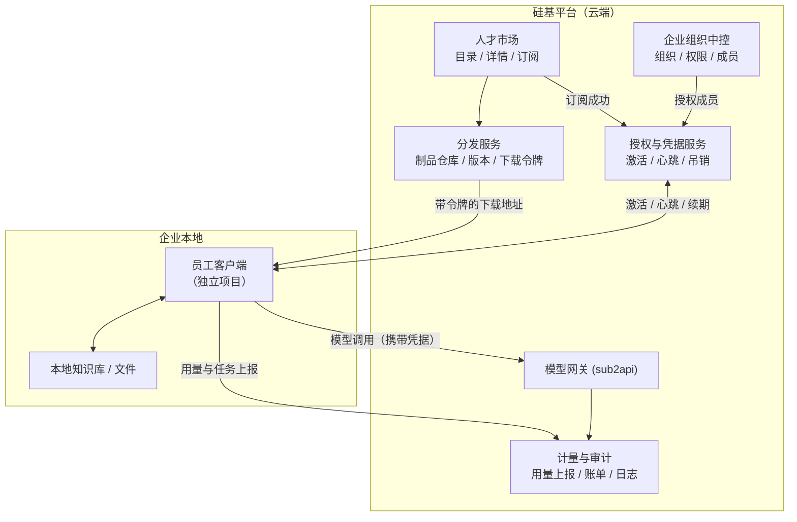

# 硅基员工平台 —— 方向调整设计方案 v3

## 1. 文档说明

本文承接 `硅基员工平台设计方案.md`（2026-07-27 会议提炼版，下称「总体方案」），
针对一处**关键实现方式变更**给出落地设计：

> 硅基员工不再以「平台内对话」的方式交付，而是**订阅后下载到本地运行**
> （客户端 / 安装包 / zip 等形态），使用方式以**配置驱动**为主，对话为辅。

这一变更改变了平台的技术边界：**平台从「运行时」退回到「分发与授权层」**。
本文说明由此产生的架构、对象模型、接口和阶段划分调整。

会议中未确认的价格、协议与远期设想不作为既定结论。术语沿用总体方案：
**碳基员工**＝企业中的人类成员；**硅基员工**＝可承担具体工作的 AI 员工。

---

## 2. 核心变更：平台不再是运行时

### 2.1 变更前后对比

| 维度 | 变更前（现有实现） | 变更后（本方案） |
|---|---|---|
| 员工存在形式 | 平台内的一条配置记录 | **可下载的员工包**（ZIP），由统一客户端加载 |
| 执行位置 | 平台服务端 | **用户本地** |
| 交互方式 | 聊天对话（SSE 流式）| **配置表单驱动**，对话为可选补充 |
| 平台职责 | 承载对话、编排工具、调模型 | **订阅、授权、分发、计量、审计** |
| 员工与平台关系 | 员工是平台的一个功能 | 员工是**独立项目**，平台是其分发渠道 |

### 2.2 这意味着什么

**平台的核心资产变成三样**：员工目录（卖什么）、订阅授权（谁能用）、
使用凭据与计量（用了多少）。执行本身移出平台。

**一个必须正视的推论**：代码一旦下载到用户本地，平台就**失去了执行过程的
强控制权**。总体方案 §4.4「统一适配与连接层」和 §7.8「审计与安全」原本
假设执行发生在平台侧；本地执行后，这两项能力必须改为**由客户端主动上报 +
平台校验凭据**的模式，且要接受「客户端可能被篡改」这一前提。

设计上不追求"防住恶意用户"（本地代码理论上都可绕过），而是做到：
- 未授权无法获得可用凭据 → 拿不到模型能力，员工是个空壳
- 正常使用路径下，用量与审计数据完整可信
- 凭据可吊销，越权可被发现

---

## 3. 总体架构（调整版）



### 3.1 与总体方案的对应关系

| 总体方案模块 | 本方案落点 | 变化 |
|---|---|---|
| §4.1 人才市场 | 人才市场 | 不变，仍是核心入口 |
| §4.2 企业组织中控 | 企业组织中控 | 不变，仍需完整建设 |
| §4.3 员工运行环境 | **统一客户端（独立项目）** | **移出平台**，平台只负责分发与授权 |
| §4.4 统一适配连接层 | **下沉到客户端内部** | 平台侧只保留「员工包清单规范」+ SDK |
| §4.5 基础支撑 | 模型网关 / 计量 / 审计 | 保留，但审计改为客户端上报 |

**§4.4 的重新定位**（回应会议纪要第 91 条）：适配器不废弃，但**服务对象变了** ——
从"平台运行时调用外部能力"变为"**员工客户端内部**接入 Coze / n8n / RPA 等能力"。
现有 `CapabilityAdapter.execute()` 抽象仍成立，只是运行位置从平台移到客户端；
平台侧保留其作为**员工打包规范的一部分**（员工声明自己需要哪些外部平台凭据）。

---

## 4. 对象模型调整

### 4.1 新增：员工包（EmployeePackage）

「可下载」这件事需要一个明确的对象承载。因已确认走**统一客户端**路线
（§8 决策 1），员工包是**被壳加载的单元**，而非独立可执行程序：

- 包 ID、所属员工模板、版本号；
- 形态：MVP 只做 `ZIP`（§8 决策 2）；预留 `DOCKER` / `SCRIPT` 供后续；
- 文件地址、大小、**SHA-256 校验和**；
- 最低客户端协议版本（壳据此判断能否加载）；
- 清单文件（见 §6）；
- 发布状态与发布时间。

校验和是必需项 —— 客户端加载前要校验包未被篡改，这也是安全审核
（总体方案 §7.1「上架与审核」）的留痕依据。

### 4.2 新增：员工实例与凭据

总体方案 §6.4 已要求「模板」与「企业实例」分离。本方案在实例上追加**激活**语义。

**员工实例（EmployeeInstance）**
- 所属企业、来源模板、模板版本；
- 企业内自定义名称（如「视频工程师」）、所属部门、负责人；
- 配置：启用哪些知识库、模型路由、初始化资料、计划任务；
- 状态：`PENDING_ACTIVATION` / `ACTIVE` / `SUSPENDED` / `REVOKED`。

> ⚠️ **同一企业可有多个实例来自同一模板**（§8 决策 8），
> 因此**不能**用 `@@unique([enterpriseId, templateId])` 约束。
> 实例靠自身 ID 标识，企业内名称建议在企业范围内唯一以避免混淆。

**凭据分两层**（因统一客户端，激活发生在「壳」这一层）：

**客户端激活凭据（ClientCredential）** —— 绑定企业 + 运行环境
- 激活码：企业管理员签发，用户首次启动壳时输入（一次性人工交付物）；
- 运行环境指纹：首次激活时登记，用于识别换机；
- 刷新令牌 + 短期访问令牌；
- 有效期（**可配置**，§8 决策 5）、最近心跳时间、吊销状态。

**实例访问权（运行期动态解析）**
- 壳激活后，凭企业级凭据拉取「本企业已订阅、且当前用户被授权」的实例清单；
- 实例的启停不需重新激活客户端，下次心跳即生效。

**为什么这样分层**：激活码是一次性的人工输入物便于交付；实际调用用
**短期令牌**，吊销才有意义 —— 企业停用实例或回收成员权限后
（总体方案 §12 验收标准第 8 条），令牌到期即失效，不依赖客户端自觉。
把激活放在壳这一层，则新订阅一个员工无需重新激活，符合"一个壳装多个员工"。

### 4.3 新增：企业组织层（总体方案 §11 第一阶段）

这部分现有代码**完全缺失**，且是其余一切的前提：

- **企业（Enterprise）**：数据与权限的隔离边界；套餐、算力账户挂在此层；
- **部门（Department）**：支持树形结构；
- **企业成员（EnterpriseMember）**：`User` × `Enterprise` 的关联，
  承载企业内角色（管理员 / 部门负责人 / 普通成员）与所属部门；
- **员工授权（EmployeeGrant）**：某实例授权给哪些部门或成员；
- **跨部门调用申请（AccessRequest）**：申请、审批、限时授权、到期回收。

> ⚠️ **现有模型是单用户视角，与「以组织为核心」冲突，需改造主体**：
> ```
> Subscription        userId → enterpriseId
> ComputeAccount      userId → enterpriseId   // 套餐含算力额度，应挂企业
> ```
> 这是数据模型重构，不是加表。

### 4.4 任务：从会话改为任务记录

总体方案 §6.5 定义的是**任务（Task）**，没有"会话"。本地执行后，
平台看不到执行过程，只能收到客户端上报的结果。因此任务对象改为：

- 任务 ID、所属企业/部门、发起人（碳基员工）、执行实例；
- 目标、输入摘要、附件引用；
- 状态：`SUBMITTED` / `RUNNING` / `SUCCEEDED` / `FAILED` / `CANCELED`；
- 输出摘要、算力消耗、时间戳；
- **来源标记**：平台派发 / 客户端本地发起（本地发起的任务补报后才可见）。

现有 `ConversationSession` + `Message` + `ToolExecution` 三张表的字段与
任务高度重叠，可作为改造基础，但**语义要换**：从"一次对话"变为"一次任务执行"。

---

## 5. 关键流程

### 5.1 订阅 → 下载 → 激活 → 工作


对照总体方案 §7.3 的招聘入职流程，本方案把「绑定运行环境」具体化为
**下载 → 安装 → 激活码激活 → 指纹登记**四步。

### 5.2 本地执行时的模型调用与计量

这是本方案**最关键的技术决策点**：

```
客户端需要调模型
  → 携带短期令牌请求平台模型网关（不是直连上游）
  → 平台校验：令牌有效？实例状态 ACTIVE？企业算力余额充足？
  → 通过则代理转发至 sub2api，返回结果
  → 平台侧记录 token 用量并扣减企业算力
```

**为什么不把上游 API Key 下发给客户端**：一旦下发，凭据即泄漏，用量无法
归属，额度无法控制，吊销也失效。让客户端**始终经平台网关调模型**，
才能同时满足计量（总体方案 §7.7）、审计（§7.8）和额度控制。

代价是客户端必须联网 —— **已确认接受**（§8 决策 3），不支持离线。
因此客户端应在启动时即校验凭据，网络不可用时明确提示不可用，
而非静默降级；心跳连续失败超阈值则进入锁定状态。

**平台现有实现可直接复用**：`sub2api` 接入、`MODEL_PRICING` 价格表、
保底计费（未配价模型按最贵档收费）、汇率可配置、`ComputeTransaction` 记账 ——
这些都已验证可用，只需把调用方从"平台内对话服务"换成"客户端网关"。

### 5.3 权限回收与吊销

企业停用员工或回收成员权限后：

1. 实例状态置 `SUSPENDED` / `REVOKED`；
2. 相关凭据标记吊销，拒绝续期；
3. 客户端下次心跳或换令牌时被拒，进入不可用状态；
4. 已下发的短期令牌在有效期内仍可用 —— **这是设计取舍**：
   令牌有效期越短，吊销越及时，但心跳越频繁。建议短期令牌有效期
   控制在分钟级到小时级，具体值待定。

---

## 6. 员工制品规范（新增，平台侧核心资产）

员工是独立项目，但要能被平台分发与管理，必须遵守统一规范。
每个制品需包含一份**清单文件**，声明：

- 员工身份：模板 ID、版本、名称、图标；
- **配置模式定义**：需要用户填哪些配置项（类型、必填、校验规则、
  默认值、分组）—— 这是「配置化使用」的基础，平台据此可在
  Web 端预览配置项，客户端据此渲染表单；
- 能力边界：能做什么、不能做什么、输入输出形式；
- 依赖声明：需要哪些模型、外部平台凭据（Coze/n8n 等）、本地权限
  （文件读写、网络、剪贴板等）；
- 上报契约：任务与用量上报的字段；
- 最低平台协议版本。

**审核依据**（总体方案 §7.1）：平台按此清单校验制品能否运行、
声明的权限是否合理、是否存在越权访问。

> 清单的具体格式（JSON Schema / YAML）和 SDK 形态待定，见 §8。

---

## 7. MVP 范围调整

### 7.1 本期必须完成

**企业组织层**（当前完全缺失，最高优先）
- 企业、部门、成员、企业内角色；
- 成员与员工实例的授权关系；
- `Subscription` / `ComputeAccount` 主体改为企业。

**人才市场**
- 员工目录：分类、搜索、筛选；
- 员工详情：按总体方案 §7.1 的「我是谁 / 我能做什么 / 如何使用 /
  做得怎么样 / 如何获得」五段式组织；
- 订阅/招聘 → 生成企业实例。

**分发与激活**（本方案新增核心）
- 员工包（ZIP）上传、版本管理、SHA-256 校验和；
- 带时效的下载令牌；
- 激活码签发与客户端激活接口；
- 实例清单与配置下发接口（壳激活后按授权拉取）。

**前端三端**（§8.2）
- 方向 1 平台运营端：补员工模板/版本/包管理 + 上架审核；
- 方向 2 企业管理端：**全新**，组织/成员/实例/授权/任务/算力；
- 方向 3 人才市场：详情页改五段式 + 订阅与下载入口。

**本地执行支撑**
- 客户端模型调用网关（校验凭据 + 额度 + 代理转发 + 计量）；
- 任务与用量上报接口；
- 心跳与令牌续期。

**计量与审计**
- 沿用现有 token 计量、保底计费、汇率配置；
- 基础审计日志：谁、何时、哪个实例、输入输出摘要、模型与算力消耗。

**员工侧**
- 至少 **1 个真实可下载、可激活、能干活的员工**，端到端验证整条链路。

### 7.2 本期不做

- 会话/聊天形态（现有 SSE 实现保留代码，不作为交付形态）；
- 多员工自动编排、指挥官自动拆解（总体方案 §8.3 亦列为后续）；
- 跨企业 MCP/Agent 协商；
- 大规模连接器生态；
- **离线运行模式**（已确认必须联网）；
- **桌面客户端壳的完整实现** —— MVP 先做「一键下载 ZIP」，
  统一客户端逐步实现（§8 决策 1、2）；
- `INSTALLER` / `DOCKER` 等其他制品形态；
- 完整商业套餐与复杂计费规则。

---

## 8. 关键决策（2026-07-27 已确认）

| # | 问题 | 决策 |
|---|---|---|
| 1 | 统一客户端还是一员工一客户端？ | ✅ **统一客户端**（一个壳装多个员工）；具体实现方式后续讨论 |
| 2 | 首批员工形态？ | ✅ **从最简开始：一键下载的压缩包**（ZIP）；客户端逐步实现 |
| 3 | 是否必须联网？ | ✅ **必须联网**，不支持离线 |
| 4 | 制品由谁构建？ | ✅ **平台提供 SDK / 脚手架** |
| 5 | 短期令牌有效期？ | ✅ **做成可配置项**（系统设置，不硬编码）|
| 6 | 知识库位置？ | ✅ **放本地**；具体读取方式后续讨论 |
| 7 | 前端范围？ | ✅ 三个方向，见 §8.2 |
| 8 | 同企业可否多实例？ | ✅ **可以**（如不同部门各一份）|

### 8.1 决策带来的设计影响

**① 统一客户端 → 制品与实例解耦**

一个壳装多个员工，意味着：
- **激活发生在「壳」这一层**，而非每个员工各激活一次；
- 壳持有企业级凭据，按需拉取该企业已订阅的员工清单；
- 员工包（ZIP）是壳的**加载单元**，不是独立可执行程序；
- 员工升级 = 壳替换对应的员工包，不需重装整个客户端。

因此 §4.1「员工制品」的语义调整为：**员工包**（可被统一客户端加载的
ZIP），而非"独立安装包"。`INSTALLER` / `DOCKER` 等类型 MVP 不做。

**② 必须联网 → §5.2 的模型网关方案成立**

这条确认后，「客户端始终经平台网关调模型、不下发上游 API Key」的方案
可以定型。计量、额度控制、吊销三件事都建立在这个前提上。

同时意味着：
- 客户端启动即需校验凭据，离线状态下应明确提示不可用而非静默降级；
- 心跳失败超过阈值应进入锁定状态。

**③ 同企业多实例 → 实例不能用 (企业, 模板) 做唯一约束**

实例需要自己的身份标识和企业内名称。两个"视频工程师"实例可以来自
同一模板，但分属不同部门、各有独立配置、独立算力归集口径。

计费口径需明确：算力按**企业**账户扣减，但用量记录要能按**实例**维度
拆分统计，否则无法回答"哪个部门用得多"。

**④ 令牌有效期可配置 → 复用现有系统设置基础设施**

平台已有 `SystemSetting` 表 + 管理端设置页 + `.env` 回退 + 敏感值加密
（`SETTING_KEYS` / `getEffectiveValue()`），汇率配置刚用这套做完并验证。
令牌有效期直接新增一个设置项即可，不需新建机制。

### 8.2 前端设计（三个方向）

对照现有 `web/src/app` 路由结构：

| 方向 | 面向 | 现有基础 | 处置 |
|---|---|---|---|
| **1. 平台运营端**<br/>管理硅基人才市场 | 超级管理员 | `(admin)/admin/*`<br/>capabilities / employees / models / settings | ⚠️ **部分复用** —— 需补员工模板/版本/制品管理、上架审核、企业列表 |
| **2. 企业管理端**<br/>B 端用户管理台 | 企业管理员 / 部门负责人 | ❌ **完全缺失** | 🔲 **新建** —— 组织架构、成员、实例、授权、任务、算力 |
| **3. 人才市场展示**<br/>员工目录与详情 | 企业用户（含未登录浏览）| `(user)/marketplace`<br/>`(user)/marketplace/[id]` | ⚠️ **部分复用** —— 详情页需改为总体方案 §7.1 五段式，并加下载/激活入口 |

**建议的路由分组调整**：

```
web/src/app/
├── (platform)/        方向 1 —— 平台运营端（原 (admin)，改名以区分）
│   ├── templates/       员工模板 + 版本 + 制品上传
│   ├── review/          上架审核
│   ├── enterprises/     企业列表与套餐
│   ├── models/          模型白名单（已有，复用）
│   └── settings/        系统设置（已有，复用）
│
├── (enterprise)/      方向 2 —— 企业管理端（全新）
│   ├── org/             组织架构：部门树 + 成员
│   ├── employees/       已订阅实例：配置 / 下载 / 激活码 / 停用
│   ├── grants/          授权管理 + 跨部门申请审批
│   ├── tasks/           任务记录与执行详情
│   └── compute/         算力用量与账单
│
├── (market)/          方向 3 —— 人才市场（原 (user)/marketplace）
│   ├── page.tsx         目录：分类 / 搜索 / 筛选
│   └── [id]/            详情：五段式 + 订阅入口
│
└── (auth)/            登录注册（已有，复用；需补企业注册流程）
```

**三端的关键差异**在权限边界，而非页面数量：

- 方向 1 看**全平台**数据（所有企业、所有模板、审核队列）；
- 方向 2 只看**本企业**数据（当前 `User.role` 无法表达，必须先有
  `EnterpriseMember` 的企业内角色）；
- 方向 3 是**公开或半公开**的展示层，不含企业私有数据。

> ⚠️ 现有 `UserRole` 枚举只有 `USER` / `CONTRIBUTOR` / `ADMIN` 三个**全局**角色，
> **无法支撑方向 2** —— 同一个人可能是 A 企业管理员、B 企业普通成员。
> 企业内角色必须落在 `EnterpriseMember` 上，这是方向 2 的前置依赖。

**现有可直接复用的前端资产**：`components/ui/*`（Card/Badge/Input/Table
等基础组件）、`features/auth`、`features/model`、TanStack Query + Zustand
的数据层约定、`(user)/usage` 的用量展示（改为企业维度即可）。

**`(user)/chat` 与 `features/chat`**：本期不作为交付形态，保留不删。

### 8.3 仍待确认

| # | 问题 | 影响 |
|---|---|---|
| 1 | 统一客户端的技术选型（Electron / Tauri / CLI 壳）| 决定员工包的加载机制与本地权限模型 |
| 2 | 员工包内部结构与清单格式（JSON Schema / YAML）| SDK 脚手架的产出物规范 |
| 3 | 本地知识库的读取方式（客户端直读目录 / 索引后上传摘要）| 涉及数据边界与合规，总体方案 §7.6 已列为难点 |
| 4 | 企业注册与开通流程（自助注册 / 运营开通）| 影响 `(auth)` 分组与企业初始化逻辑 |
| 5 | 未登录用户能否浏览人才市场 | 影响方向 3 的鉴权设计 |
| 6 | 令牌有效期的推荐默认值 | 已确认可配置，但需给一个合理初值 |

---

## 9. 现有代码处置

基于对现有 27 个 Prisma 模型和各模块的核对：

| 现有资产 | 处置 | 说明 |
|---|---|---|
| 用户认证（JWT） | ✅ 复用 | 需补企业维度 |
| `Capability` + 4 类配置表 | ✅ 复用 | 语义调整为「员工声明的依赖能力」 |
| 能力适配器（Coze 已验证）| ✅ 复用，**位置下沉** | 从平台运行时移入客户端；Coze 端到端已验证，证明技术路径可行 |
| `MODEL_PRICING` / 保底计费 / 汇率配置 | ✅ 直接复用 | 已验证，客户端网关沿用 |
| `ComputeAccount` / `ComputeTransaction` | ⚠️ 改造 | 主体 user → enterprise |
| `DigitalEmployee` | ⚠️ 拆分 | 拆为「市场模板」+「企业实例」 |
| `Subscription` | ⚠️ 改造 | 主体 user → enterprise |
| `ConversationSession` / `Message` | ⚠️ 改造或保留 | 字段可作 `Task` 基础，语义换为任务记录 |
| 对话流式服务（SSE）| ⏸️ 保留不删 | 本期不作为交付形态；若员工客户端需要对话补充形态，逻辑可复用 |
| 工具调用循环 | ⏸️ 保留不删 | 同上；若下沉到客户端可移植 |
| `(admin)/admin/*` | ⚠️ 部分复用 | 方向 1 基础；需补模板/版本/包管理与审核 |
| `(user)/marketplace` | ⚠️ 部分复用 | 方向 3 基础；详情页改五段式 + 下载入口 |
| 企业管理端 | ❌ 缺失 | 方向 2 完全新建 |
| `components/ui/*`、`features/auth`、`features/model` | ✅ 直接复用 | 基础组件与数据层约定 |
| `UserRole` 枚举（3 个全局角色）| ⚠️ 不够用 | 企业内角色须落在 `EnterpriseMember` |

**明确不删除任何已验证代码。** 会话与工具调用虽不作为本期交付形态，
但其中沉淀的经验（AI SDK v7 字段结构、Coze SSE 解析、工具名归一化等）
在员工客户端内部若需同类能力时可直接移植。

---

## 10. 建议实施顺序

| 阶段 | 内容 | 依赖 | 可否开工 |
|---|---|---|---|
| 一 | 企业组织数据模型（含 `EnterpriseMember` 企业内角色）+ 主体改造（`Subscription`/`ComputeAccount` → enterprise）| 无 | ✅ **立即** |
| 二 | `DigitalEmployee` 拆分为「市场模板」+「企业实例」（允许同企业多实例）| 阶段一 | ✅ 立即接续 |
| 三 | 人才市场主线（方向 3）：目录 / 五段式详情 / 订阅→实例 | 阶段二 | ✅ |
| 四 | 企业管理端（方向 2）：组织 / 成员 / 实例 / 授权 | 阶段一、二 | ✅ |
| 五 | 员工包管理 + 下载令牌 + 激活码（方向 1 补充）| 阶段二 | ✅（ZIP 形态已定）|
| 六 | 客户端模型网关 + 用量上报 + 心跳吊销 | 阶段五 | ✅（联网已定，令牌有效期做成配置项）|
| 七 | SDK / 脚手架 + 员工包清单规范 | 阶段五 | ⚠️ 需先定清单格式（§8.3 问题 2）|
| 八 | 第一个真实员工端到端联调 | 全部 | ⚠️ 依赖阶段七 |
| 九 | 统一客户端壳实现 | 阶段六、七 | ⚠️ 需先定技术选型（§8.3 问题 1）|
| 十 | 组织管理完善（跨部门申请、统计报表）| 阶段一 | ✅ |

八条决策确认后，**阶段一到六均可开工**，不再被待确认事项阻塞。
阶段七、九需要 §8.3 剩余问题的答案才能定型。

**建议起点**：阶段一。理由是它零依赖，且是方向 2（企业管理端）和
所有授权逻辑的前置 —— 现有 `UserRole` 三个全局角色无法表达
"同一个人在 A 企业是管理员、在 B 企业是普通成员"，这个不解决，
企业管理端做不出来。

---

## 11. 验收标准

沿用总体方案 §12，按本方案的交付形态改写：

1. 管理员能创建企业、部门和碳基员工成员；
2. 管理员能从市场订阅一名硅基员工，生成企业专属实例；
3. 管理员能为实例配置名称、部门、模型路由和初始化资料；
4. 管理员能**一键下载员工包（ZIP）并校验完整性**（SHA-256 一致）；
5. 用激活码**成功激活**，客户端拉到本企业已授权的实例清单与配置；
6. 成员通过**配置表单**提交一个任务，获得可用结果；
7. 管理员能在平台看到该任务的输入输出摘要、状态、耗时和算力消耗；
8. 未授权成员无法激活该员工，也无法调用；
9. **实例被停用后，客户端在令牌到期后无法继续调用模型**；
10. 企业算力余额不足时，客户端调用被拒并有明确提示；
11. **同一企业能订阅同一模板的两个实例**，各自独立配置、
    用量可按实例维度拆分统计；
12. **断网时客户端明确提示不可用**，不静默降级。

第 4、5、9、10、11、12 条是本方案相对总体方案**新增**的验收点，
对应「下载到本地运行」「统一客户端」「必须联网」「同企业多实例」
这四项决策带来的新风险面。
