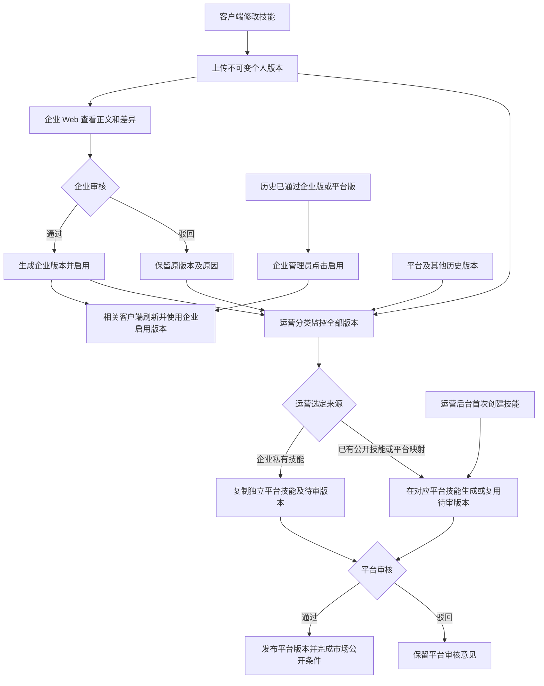

# 技能库客户端修改与 Web 审核启用改造方案 v2

- 日期：2026-10-09
- 状态：用户已确认 D1～D5，业务规则已冻结；本地代码实现、自动化检查和模拟 API 页面验收已完成，结果见第 12 节。未部署生产，真实客户端联调待完成。
- 规则确认：2026-10-09；用户确认审核通过即启用、正式执行统一跟随、所有版本可由运营选审且分类展示、首次创建暂留运营后台、私有技能上架复制独立平台技能。
- 范围：SKILL 技能库、客户端上传与生效版本、企业审核和启用、运营监控及市场发布。
- 依据：本次用户需求、提供的两张技能详情截图，以及当前工作区源码。客户端独立仓库和生产数据未核验。
- 文档关系：本方案替代《技能库技能审核统一优化方案-v1》中 Web 编辑、个人自主选版、企业主动投稿平台规则；本地新实现的客户端契约见 `docs/对接/SEP客户端技能提交与企业审核接口对接文档-v3.md`。对接 v2 仅作历史参考，部署状态须另行确认。

## 1. 本次已经明确的业务方向

1. 已有技能正文修改集中到客户端。企业／个人 Web 关闭副本创建、正文编辑、包替换等写入口；技能首次创建暂时保留在运营后台，作为唯一 Web 正文生产例外。
2. 企业 Web 用于查看客户端上传版本、预览正文与差异、审核、管理企业启用版本。
3. 企业审核通过即生成企业可用版本并自动启用；正式执行统一跟随企业当前启用版本，历史个人 PIN 和 Web 副本不再抢占默认。
4. 取消企业向平台主动投稿技能的机制。
5. 运营后台分类监控所有企业和个人的技能修改版本。企业待审、通过、驳回及历史版本均可由运营选择进入平台审核；市场发布仍需平台审核通过。
6. 版本页移除“设为个人使用”“使用此副本”；将“设为企业默认”统一改为“启用”。
7. 个人来源记录、企业发布记录、平台发布记录仍需保留来源和审核历史，不能因 UI 简化而覆盖或删除。
8. 企业私有技能首次上架时复制为独立平台技能及平台版本，保留原企业技能、归属、审核和启用状态；后续通过来源映射持续更新同一平台技能。

权限建议沿用当前角色：企业管理员审核、启用本企业版本；普通成员查看有权访问的内容；平台运营监控全平台并审核上架。RPA、AGENT、AI_APP 不因本次 SKILL 调整改变流程。

## 2. 实施前代码调研结论

本节记录 2026-10-09 开发前基线，不是新实现的当前行为；实施结果见第 12 节。

### 2.1 现有两种个人版本不是同一对象

| 来源 | 入口和数据 | 当前行为 |
| --- | --- | --- |
| Web 工作副本 | `POST /enterprise/capabilities/:capabilityId/personal-version`；`PATCH /enterprise/personal-versions/:id` | 可编辑的 `PERSONAL_ACTIVE`，创建时会记录个人选择；保存后本人选用此副本时生效 |
| 客户端保存 | `POST /enterprise/skill-versions`，必带 `Idempotency-Key` | 每次新保存产生独立 `PERSONAL / PENDING_ENTERPRISE_REVIEW` 记录；内容保留完整 SKILL.md；重试返回原记录 |
| 企业共享版本 | 统一企业审核服务或管理员直接发布 | `ENTERPRISE / ENTERPRISE_APPROVED`；与原个人记录通过来源关系关联 |
| 平台版本 | 企业投稿或运营主动采纳企业版 | 新建 `PLATFORM` 副本，不原地改变企业版归属 |

截图中的“我的副本”不能作为 Web 来源证据：时间线按 PERSONAL 作用域命名，客户端提交也会显示这个名称。“大家的改动”中的“客户端提交”与是否存在可编辑工作副本才是区分来源的线索。

主要源码：

- `backend/src/modules/skill-version/personal-skill-submission.service.ts`：客户端完整正文保存、来源可见性、幂等、版本查询。
- `backend/src/modules/skill-version/skill-version.service.ts`：Web 工作副本、企业编辑和发布、时间线、个人选择与实际执行版本解析。
- `backend/src/modules/skill-version/skill-version.controller.ts`：企业和运营版本接口。

### 2.2 企业审核通过已经会生成企业版并更新默认

`EnterpriseSkillReviewService.reviewMany()` 通过时在同一事务中：

1. 校验企业管理员及来源归属，取得企业技能锁和来源记录锁。
2. 固定 Web 工作副本快照，或更新客户端不可变提交的审核状态。
3. 写入审核记录，生成新的已通过企业版本。
4. 写入 `SkillVersionAdoption` 来源关系。
5. 调用 `EnterpriseSkillDefaultService.set()`，更新企业技能默认和相关有效订阅默认。

因此，“客户端版本通过后形成企业默认”已经有基础，不需要再建一套审核模块。现有管理员自建企业草稿直接发布，也会更新默认；此 Web 正文生产路径应随新规则关闭。

当前多人审核可能合并正文。本期逐条审核客户端原始修改，关闭多人合并后编辑正文的路径，不新增自动合并能力。

### 2.3 删个人选版按钮不会自动让全员使用企业默认

当前 `resolveEffectiveVersion()` 顺序：

```text
本人明确 PIN / FOLLOW
  → 无选版记录时兼容 PERSONAL_ACTIVE 工作副本
  → EnterpriseSkillDefault
  → SubscriptionSkillVersion
  → 员工模板绑定默认平台版本
  → 最新已通过平台版本
```

`EnterpriseSkillDefaultService.set()` 不改 `MemberSkillVersionSelection`。所以只改 UI，历史 PIN 和 Web 副本仍会影响执行，与“企业统一启用”可能冲突。

已确认目标：企业托管及客户端正式执行统一跟随企业启用版本，停止个人 PIN/FOLLOW 对正式执行的影响，并关闭相应写入能力；历史选择保留用于审计。客户端可保留本地编辑和测试，但不得自动替代正式执行版本，或将测试正文同步为企业启用。

### 2.4 客户端 runtime 与云端执行目前不是同一解析入口

- `CapabilityService.execute()` 调用 `SkillVersionService.resolveEffectiveVersion()`，返回实际 `skillVersionId`。
- `ClientService.getRuntime()` 当前只取订阅选版或员工模板绑定版本，没有复用上述解析，绑定查询也没有与技能列表一致地过滤 `enabled`。
- 客户端 runtime 接口是 `GET /client/subscriptions/:subscriptionId/runtime`。
- `GET /enterprise/employees/:employeeId/skills` 和技能时间线另有企业默认／本人实际使用摘要。

改造时必须统一这些入口，覆盖企业默认回退、新订阅继承、禁用绑定和缓存刷新。仅修改 Web 默认标记不能证明客户端实际执行已改变。

### 2.5 运营采纳已有部分基础，但仍需要扩展

现有运营版本服务已具备列表、详情、平台审核及主动采纳企业版本能力；默认列表排除 PERSONAL，显式传 PERSONAL 也会被拒绝，主动采纳来源只认 ENTERPRISE。详情接口按已知 ID 可以读取个人版本，但列表无法发现它。用户要求的“所有企业和个人修改”需要增加个人来源监控和采纳资格。

运营页面目前只取最近 100 条，没有分页；后台查询不能靠扩大 limit 代替全量监控。这里的“个人版本”包括企业成员 PERSONAL 提交；无企业的独立贡献者当前创建 PLATFORM 版本，两者不能按作者身份混为同一作用域。

平台版本审核通过会推进员工模板中已有的平台默认绑定，但版本通过和能力首次公开不是同一动作。市场公开还涉及 `Capability.visibility`、`platformReviewStatus`、能力状态以及员工绑定；必须核实实际市场展示与技能下载链路。

还有两条需要同时调整的旧流程：

- 贡献中心首发走“申请投稿 → 企业授权 → 平台能力审核”；关闭版本页投稿按钮不能停止它。
- 贡献中心企业版本迭代在能力已经公开时，会在企业审核通过后自动复制平台待审副本。新规则由运营自主选择，一并停止该 SKILL 自动送审，而保留已经形成的待审记录。

现有能力首发平台审核可能把同能力下多个平台待审版本一起通过。新的“选中哪个版本就上架哪个”必须精确到所选版本，不能无条件复用此批量通过行为。

## 3. 用户已确认的五项产品决策

以下规则已由用户于 2026-10-09 确认，作为本次开发与验收依据。

| 编号 | 已确认规则 | 开发影响 |
| --- | --- | --- |
| D1 | 企业审核通过即自动启用；“启用”用于切换历史已通过企业版或平台版 | 保留审核事务中的默认更新，审核结果与启用结果一致提交 |
| D2 | 企业托管与客户端正式执行统一跟随企业启用版本；本地编辑测试可保留，不改变正式版本 | 关闭个人 PIN/FOLLOW 写入及解析优先级，保留历史记录；统一云端、runtime 和页面摘要 |
| D3 | 运营监控并可选择所有版本进入平台审核，不以企业审核通过为前置；后台必须分好类 | 覆盖个人、企业、平台及历史记录，分别展示来源、企业审核、平台处理状态；待审和驳回来源也可收录，平台审核结果独立 |
| D4 | 技能首次创建暂时放在运营后台；已有技能正文修改仍通过客户端 | 保留运营新建表单及首次正文／包上传，关闭企业和个人创建、编辑旁路；本期不新增客户端新技能注册接口 |
| D5 | 企业私有技能首次收录复制成独立平台技能 | 新建平台 Capability 与所选 PLATFORM 版本，保留源企业 Capability；建立来源映射、处理跨能力版本关联、后续更新和奖励去重 |

运营首次创建是明确的例外，不扩展为运营可直接编辑企业／个人已有正文。创建后进入平台待审流程，审核通过才公开；名称、说明等上架元数据仍可维护。AI 建议可保留分析和只读内容，编辑正文后直接采纳生成企业版的路径关闭。

## 4. 已确认的目标流程

企业通过即启用；平台对所有来源独立选审。运营首次创建和私有技能复制收录同时纳入目标流程。



企业审核和平台审核独立：平台结果不反写原个人／企业审核状态，企业启用也不代表市场上架。平台发布不得覆盖企业显式启用的历史企业版或平台版。

“默认”沿用当前企业和技能维度保存，即同企业不同数字员工绑定同一技能时共用启用版本；实际执行仍需要有效订阅和技能授权。

审核和启用不修改客户端当前正在执行的任务；生效点建议定为下一次任务开始或重新加载技能时，客户端需展示版本 ID 并上报实际使用版本。

## 5. 页面改造

### 5.1 企业技能详情

- 版本页移除“个人使用版本”操作区、个人 PIN/FOLLOW 操作、“设为个人使用”“使用此副本”和平台投稿按钮。
- 已发布企业版和已通过平台版，只为管理员显示“启用”；当前启用行显示“已启用”且不可重复点击。
- 保留正文展开、来源、变更说明、审核状态、审核人及审核时间。
- “企业默认”“我当前使用”收敛成“企业当前启用”；不再用绿色选中行暗示个人 PIN。
- 客户端个人提交显示“个人提交”或“客户端版本”；历史 Web 记录显示“历史 Web 副本”，不混称“我的副本”。
- 未审核个人记录不提供企业“启用”；通过后生成企业共享版本并自动启用。企业驳回的来源仍可被运营收录，但不能因此直接成为原企业启用版本。
- “大家的改动”保留列表、筛选、正文／差异预览、通过／驳回和来源追溯；移除“创建我的副本”、正文编辑及草稿管理。
- 普通成员看有权访问的企业已发布版本及自己的提交；他人私有正文沿用现有权限，不能因运营全量监控扩大企业成员权限。

### 5.2 其他 Web 写入口

需要同时清理企业版编辑页面、能力详情创建企业草稿、贡献中心 Skill 正文编辑／包上传／迭代版本提交、AI 建议编辑采纳，以及运营已有正文编辑旁路。运营新建技能表单及首次正文／包上传保留；贡献中心和运营能力页面混用 SKILL/RPA 等类型，按能力类型处理，不能整页删除导致其他能力无法投稿。

旧编辑 URL 应跳转对应技能的只读详情，不能仅隐藏导航。旧草稿不能继续从收藏链接发布或覆盖正文。

具体入口核查清单（行号以本次工作区为准）：

| 入口 | 源码位置 | 处理要点 |
| --- | --- | --- |
| 创建、编辑、保存、弃用个人工作副本 | `web/src/features/capability-iteration/personal-changes-panel.tsx:267` | 移除工作副本管理；客户端提交和历史记录保持只读 |
| 时间线企业正文编辑链接 | `web/src/features/capability-iteration/version-timeline-panel.tsx:261` | 移除链接；统一已通过版本“启用”操作 |
| 企业正文编辑路由保存和直接发布 | `web/src/app/(enterprise)/skills/[versionId]/edit/page.tsx:62` | 旧 URL 转只读，服务端关闭对应正文写入 |
| 员工详情创建企业版 | `web/src/app/(enterprise)/my-employees/[id]/page.tsx:675` | 移除创建入口；同页默认选择与个人选版导航一起调整 |
| AI 建议编辑采纳 | `web/src/features/capability-iteration/insights-panel.tsx:197` | 关闭 `POST /enterprise/insights/:id/adopt` 正文生产分支；分析和拒绝建议可保留 |
| 贡献中心创建能力 | `web/src/features/contribution/contribution-create-dialog.tsx:57` | 只处理 SKILL 分支，保留 RPA 等其他能力类型 |
| 贡献 Skill 包上传 | `web/src/features/contribution/use-contributions.ts:61` | 关闭 Web 的 `POST /contributions/skill-package` 写入口；客户端所需包上传另核契约 |
| 贡献迭代发布 | `web/src/features/contribution/contribution-detail.tsx:206`、`web/src/features/contribution/components/version-publish-dialog.tsx:19` | 关闭新版本包上传及 `POST /contributions/:id/versions` 的 Web SKILL 分支 |
| 贡献草稿正文编辑 | `web/src/features/contribution/contribution-detail.tsx:296`、`web/src/features/contribution/components/version-edit-dialog.tsx:49` | 关闭 SKILL 的 `PATCH /contributions/versions/:id` 正文改写 |
| 运营官方技能新建 | `web/src/app/(platform)/admin/capabilities/new/skill-form.tsx:58` | 保留首次创建与包上传，使用平台管理员权限并进入待审；此处使用原生 fetch，验证时覆盖实际创建请求 |
| 运营 binding 配置编辑 | `web/src/app/(platform)/admin/employees/[id]/bindings/page.tsx:187`、`web/src/app/(platform)/admin/employees/[id]/bindings/sortable-binding-item.tsx:63` | 已确认可改 config，是否能覆盖正文需实施时核查；保留正常配置和 enabled 开关 |
| 技能库宣传及个人标签 | `web/src/app/(enterprise)/capabilities/page.tsx:24`、`web/src/app/(enterprise)/capabilities/[capabilityId]/page.tsx:27` | 清理“Web 创建副本”等文案；补充来源字段后准确区分客户端提交和历史 Web 副本 |

时间线当前类型没有工作副本来源字段，不能仅修改前端标签来推断来源。后端版本摘要需补充可靠来源信息，并复用现有个人改动列表对工作副本的识别规则。

审核时固定快照、生成企业发布版，以及运营收录生成平台版，属于审核发布动作，应保留。正文复制到剪贴板也可保留。绑定的 enabled 能力开关与版本“启用”含义不同，不因关闭 config 正文旁路一起移除。遗留个人版本采纳和企业草稿发布 hooks 即使没有组件调用，也需检查接口，避免成为 Web 正文写入旁路。

### 5.3 运营后台

- 在现有技能版本管理上增加企业、用户、技能、来源作用域、企业审核状态、平台收录状态、时间筛选；使用稳定分页，不限于最近 100 条。
- 列表覆盖个人提交、企业共享版、平台版本、历史 Web 副本及其他历史版本；不把工作副本审核快照和原副本重复计为两次用户修改。
- 详情展示只读正文、与来源版本的差异、企业审核记录、发布去向、平台审核记录。
- 运营选定来源后进入平台审核，再通过发布上架；避免继续暴露绕过审核的“直接发布”分支。
- 不要求企业先点投稿，不向企业展示“投稿平台”待办。
- 已上架结果应区分“平台版本已发布”“能力已公开”“已用于市场数字员工”，不能以单个状态代替全部结果。

后台分类要求：

| 分类维度 | 展示与筛选要求 |
| --- | --- |
| 来源归属 | 个人提交、企业发布、平台版本；显示企业、作者和源技能，独立个人作者仍按真实作用域归类 |
| 产生方式 | 客户端提交、历史 Web 副本、审核生成、运营创建、平台收录；保留来源链，区分用户修改与系统派生版本 |
| 企业审核 | 未提交企业审核、待审、已通过、已驳回；保留历史草稿／归档状态，展示原因和审核时间；历史 Web 副本没有匹配修订的企业审核记录时归为未提交，平台收录快照不改变企业审核状态 |
| 平台处理 | 未收录、待平台审核、平台已驳回、平台已发布；同时显示是否市场公开及市场绑定情况 |
| 当前使用 | 企业当前启用、平台当前发布、历史版本分别标记，不能用一个“已启用”表示全部状态 |

来源、企业审核和平台处理是独立维度。例如“个人提交／企业已驳回／平台已发布”是允许的组合；平台发布不反写企业驳回结果。所有来源状态均可供运营选审，历史可变副本先固定快照；平台已有版本复用其审核和发布记录，避免复制自身或重复上架。运营可在“全部版本”检索，再通过上述筛选定位分类。

企业私有技能首次收录时，运营详情同时显示“源企业技能”和“独立平台技能”的关联。平台技能仅复制选定版本及必要的公开元数据，不公开源企业的其他版本、内部审核记录或执行数据。

## 6. 接口与后端改造清单

### 6.1 保留并复用

| 接口／服务 | 建议处理 |
| --- | --- |
| `POST /enterprise/skill-versions` | 保留为客户端上传主入口；完整正文、来源校验、幂等语义不变 |
| `POST /enterprise/skill-versions/:id/review` | 复用统一审核事务；通过时自动调用默认服务 |
| `GET /enterprise/capabilities/:capabilityId/personal-diffs` | 保留，客户端提交为主要来源；历史副本只读兼容 |
| `GET /enterprise/capabilities/:capabilityId/versions` | 返回明确的企业启用版本，移除或调整个人使用字段 |
| `POST /enterprise/capabilities/:capabilityId/default-version` | 可保留路径，UI 调用语义为“启用”；无需仅为改文案新建平行接口 |
| `EnterpriseSkillDefaultService` | 复用持久化默认、订阅同步和事务锁 |
| `GET /client/subscriptions/:subscriptionId/runtime` | 使用统一有效版本解析；只返回有效绑定和允许执行的技能 |
| `CapabilityService.execute()` | 与客户端下发采用同一解析规则；实际版本归因保留 |

### 6.2 关闭的旧业务能力

| 入口 | 建议处理 |
| --- | --- |
| Web 创建／保存个人副本 | 关闭页面与对应工作副本创建、编辑接口；历史内容可预览 |
| 创建企业草稿、编辑企业草稿、直接发布草稿 | 关闭正文生产与绕过客户端的发布链路 |
| 个人选版 `select-personal-version` | 拒绝新的个人 PIN/FOLLOW 写入；正式解析忽略历史个人选择并保留审计记录 |
| 企业版本 `submit-platform-review` | 取消 SKILL 新投稿；历史平台审核记录保留 |
| 贡献中心 Skill 平台申请／授权投稿与已公开能力迭代自动送审 | 按 SKILL 限制，避免能力级接口或自动复制继续进入旧流程；不影响 RPA |
| AI 迭代建议采纳正文 | 关闭可直接生成企业版的写入分支，建议分析可只读保留 |
| 运营已有技能正文编辑 | 关闭已有正文改写；首次创建及首次正文／包上传保留，创建后进入平台待审 |

共享上传接口保留给客户端时，不能仅凭 Origin、Referer 或隐藏按钮宣称服务器能辨认客户端。关闭旧 Web 专用能力要在后端服务层生效；若要求客户端成为唯一可信写入来源，需要在现有认证体系内明确客户端身份校验，运营首次创建保留管理员入口，其他已有技能正文接口不得成为修改旁路。

旧接口返回停用错误还是短期兼容，需在实施阶段结合已发布客户端调用确定；不能关闭客户端仍在使用的完整正文上传入口。

### 6.3 平台监控和市场发布

扩展 `listAdminVersions()` 默认作用域为平台、企业、个人，并加入企业／个人／技能筛选和稳定分页。运营详情补充 owner、企业及原始来源；所有接口仍受现有平台管理员权限保护。

将当前企业版主动采纳能力扩展为“选择来源版本”，支持 PERSONAL 和 ENTERPRISE 的所有来源状态，包括企业待审、驳回及历史版本，不以企业审核通过作为资格门槛。PLATFORM 记录也纳入监控，复用其平台审核／发布流程，不为其复制自身。历史可编辑工作副本先固定不可变快照，再作为来源。复制时保留完整正文、包信息、源版本和源企业／用户审计归属；所有上架仍通过统一的平台校验和审核。

采用“选定来源 → 平台待审副本 → 审核通过并发布”的同一链路，禁止通过 `mode=PUBLISH` 绕过新审核要求。同一来源重复选择应复用已有平台处理记录，或返回明确冲突；驳回后可重新处理，但不能复制出重复上架版本。

市场发布必须核对以下实际关联：

1. 平台版本状态为 `PLATFORM_APPROVED` 并有审核记录。
2. 企业私有技能首次收录新建独立平台 Capability 和待审版本；审核通过时仅更新平台技能的公开状态，原企业技能继续私有。不能只改 SkillVersion 后宣称已上架。
3. 已有公开能力的新版本推进相应平台绑定默认，同时保留企业自己的启用选择。
4. 技能公开目录与硅基员工市场的商品展示链路区分清楚；若市场以员工为商品，未绑定员工的技能不能宣称已经产生市场商品。
5. SKILL.md 只有正文时能完整读取；有包时正文、包文件和包哈希保持同源，不把旧 capability 包当作新平台版本的包。
6. 复用现有正文 validator、包静态扫描和下载资格，统一覆盖新平台来源选择及审核发布。当前 `SkillVersionService` 主动采纳和平台版本审核缺少贡献中心已有的扫描门禁，需在本次发布链路补齐；扫描通过不能描述为已经做了沙箱执行。
7. 首发能力公开只通过被选定的平台版本，不顺带通过该能力其他待审版本。校验按选定来源及其包执行，避免历史失败草稿误阻塞合格版本。
8. 平台已有版本推进只更新默认版属于 PLATFORM 的现有绑定，不会自动创建绑定，默认版本为空的绑定也未被该推进覆盖。市场分发需要明确这一边界。

企业私有技能采用独立平台能力方案：

1. 首次收录新建平台所有的 Capability，关联所选 PLATFORM 版本；源企业 Capability 的 enterpriseId、可见性、审核和启用状态保持原值。
2. 建立“源企业能力 → 平台能力”的持久映射，以及“源版本 → 平台版本”的来源关系。后续选择该源技能的其他版本，复用已映射的平台能力，不能每次收录都新建市场技能。
3. 当前采纳仍使用同一个 capabilityId，需改造跨 Capability 的来源关联、权限、版本编号和查询；映射复用及首次创建需有幂等／唯一约束，防止并发重复收录。
4. 已有公开技能继续沿用现有平台能力发布新版本；不能把历史已公开能力无依据重新复制或迁移。对已有私有技能的平台采纳记录，先兼容读取和查重，不在本次文档修改中执行历史数据迁移。
5. 现有首发奖励按 capability 级别去重，独立平台能力必须保留原始来源及奖励去重关系，避免因换 capabilityId 重复奖励。沿用既有奖励规则，本方案不新增奖励类型。

## 7. 数据与历史兼容

优先复用现有 `SkillVersion`、`SkillVersionReview`、`SkillVersionAdoption`、`EnterpriseSkillDefault`、`SubscriptionSkillVersion`，不为改按钮新建版本或默认表。

- 个人提交、来源版本、审核记录、执行版本和已发布企业／平台版本都保留。
- `PERSONAL_ACTIVE`、历史草稿及驳回版保持可读，停止新 Web 正文写入。无须立即删除历史枚举；更新已过时的 Prisma 注释。
- 正式执行解析器停止使用 `MemberSkillVersionSelection` 和个人副本回退，保留历史记录作审计；关闭个人 PIN/FOLLOW 新写入，客户端也不能重新设置正式个人版本。
- 历史默认优先保留 `EnterpriseSkillDefault`。缺失默认的企业按有效订阅／平台绑定的已通过版本回退，排除个人 PIN 和工作副本，并在实际启用时写入；不能按创建时间批量推断需要启用哪一版。
- 已经投稿形成的 PLATFORM 待审版本继续进入运营处理；新投稿禁用。原企业版本及已通过平台版本保留。
- `sourceVersionId` 当前为 unique，支持一个来源对应一个平台副本；扩展个人采纳和重试时考虑已有收录记录。独立平台能力映射需要持久化；实施时优先复用现有可表达映射的结构，不能依赖标题匹配或内存缓存。
- 新增企业启用切换应记录操作者、时间、前后版本。当前默认行会覆盖，不足以形成完整切换历史；可复用审计日志，确无现成能力再评估新增记录结构。
- 本次方案不执行数据迁移、默认重置、历史删除或数据库操作。需要 schema 修改时迁移由 Prisma 生成，并按环境部署流程执行。

## 8. 文件影响清单

| 模块 | 重点文件 |
| --- | --- |
| 企业审核 | `backend/src/modules/skill-version/enterprise-skill-review.service.ts` |
| 默认与执行解析 | `backend/src/modules/skill-version/enterprise-skill-default.service.ts`、`skill-version.service.ts` |
| 客户端上传 | `backend/src/modules/skill-version/personal-skill-submission.service.ts` |
| 接口与共享校验 | `backend/src/modules/skill-version/skill-version.controller.ts`、`backend/src/shared/skill-version.dto.ts` |
| 客户端技能下发 | `backend/src/modules/client/client.service.ts` |
| 云端实际执行与市场可见性 | `backend/src/modules/capability/capability.service.ts` |
| 原贡献投稿与包校验 | `backend/src/modules/capability-contribution/`、`backend/src/modules/skill-package/` |
| AI 建议正文写入 | `backend/src/modules/capability-insight/` |
| 数据模型 | `backend/prisma/schema.prisma`，仅在确有模型变更时新增工具生成迁移 |
| 企业技能详情 | `web/src/features/capability-iteration/` |
| 企业编辑路由 | `web/src/app/(enterprise)/skills/[versionId]/edit/page.tsx` |
| 版本 hooks 与预览 | `web/src/features/skill-version/use-skill-version.ts`、`SkillVersionPreviewDialog.tsx` |
| 贡献编辑旁路 | `web/src/features/contribution/`、对应企业贡献页面 |
| 运营技能页 | `web/src/app/(platform)/admin/skills/`，以及能力创建／编辑页 |
| 客户端对接文档 | 新规则冻结后编写 v3，并标注当前 v2 的被替代部分 |

客户端实际代码不在当前 pnpm workspace 中。本仓库能完成服务端契约和 Web，客户端编辑、同步、版本安装及本地执行需要客户端开发共同完成，不能以服务端构建通过代替客户端验收。

关键调研定位（行号以本次工作区为准）：

| 事实 | 源码位置 |
| --- | --- |
| 客户端不可变保存与幂等 | `backend/src/modules/skill-version/personal-skill-submission.service.ts:41` |
| 审核创建企业版本并改默认 | `backend/src/modules/skill-version/enterprise-skill-review.service.ts:78` |
| 企业持久化默认与订阅同步 | `backend/src/modules/skill-version/enterprise-skill-default.service.ts:16` |
| 个人优先的执行解析 | `backend/src/modules/skill-version/skill-version.service.ts:393` |
| runtime 另行解析技能 | `backend/src/modules/client/client.service.ts:719` |
| 运营列表排除 PERSONAL | `backend/src/modules/skill-version/skill-version.service.ts:490` |
| 运营只复制企业源版本 | `backend/src/modules/skill-version/skill-version.service.ts:672` |
| 平台默认绑定推进 | `backend/src/modules/skill-version/skill-version.service.ts:751` |
| 贡献中心首发能力公开 | `backend/src/modules/capability-contribution/capability-contribution.service.ts:1074` |
| 已公开能力企业迭代自动送审 | `backend/src/modules/capability-contribution/capability-contribution.service.ts:1487` |
| 能力市场查询 | `backend/src/modules/capability-contribution/capability-contribution.service.ts:1706` |
| 具体平台版本下载资格 | `backend/src/modules/capability-contribution/capability-contribution.service.ts:2112` |
| 公开员工和能力绑定 | `backend/src/modules/digital-employee/digital-employee.service.ts:97` |

## 9. 实施顺序

1. 以已确认 D1～D5 为开发基线，先明确接口兼容与客户端联调安排，区分正式执行和本地测试。
2. 先补后端行为回归：审核与启用、旧个人 PIN、平台个人来源、市场公开及 runtime 一致性。
3. 调整审核／启用和统一解析；保留已有事务锁、来源不可变和重复审核冲突处理。
4. 完成运营全量分类监控、所有来源选审、独立平台能力映射和审核发布，联通市场可见性和下载／读取；保留运营首次创建。
5. 关闭企业／个人 Web Skill 正文编辑及创建旁路、运营已有正文编辑，简化企业详情操作和标签，保留只读旧路由兼容。
6. 输出客户端新契约并联调上传、审核结果刷新、启用版本同步、缓存和执行归因。
7. 验证旧数据、进行实际页面验收；通过后再安排部署。关闭旧写入口和客户端新契约需要协调发布次序。

## 10. 验收与测试

### 10.1 业务验收

| 场景 | 预期 |
| --- | --- |
| 企业 Web 查找所有正文编辑窗口 | 无创建副本、正文编辑、包替换、管理员直接正文发布入口；旧 URL 进入只读详情 |
| 客户端提交和幂等重试 | 保留完整正文；同 Key 同内容返回同记录，不重复送审 |
| 企业管理员审核通过 | 只创建一个企业发布版本并同时启用；重复审核返回冲突 |
| 企业管理员驳回 | 有原因，不生成企业版、不改变企业启用 |
| 普通成员审核／启用 | 被拒绝，不能借直调接口越权 |
| 启用历史企业版／平台版 | 全企业相关正式执行统一跟随，当前版本明确显示“已启用” |
| 历史个人 PIN 和 Web 副本 | 保留记录但不参与正式执行解析；新的个人 PIN/FOLLOW 被拒绝 |
| 新订阅、停用／恢复订阅 | 默认继承与实际授权一致，不凭历史记录获得执行权限 |
| 客户端 runtime 与云端执行 | 相同企业技能启用规则，正文和实际 versionId 一致，禁用绑定不下发 |
| 企业尝试投稿平台 | 无 UI 入口，Skill 旧投稿路径不能新建平台待审；RPA 原链路正常 |
| 运营分类监控 | 全量分页检索个人、企业、平台及历史版本；来源、企业审核和平台处理分别筛选，权限不向普通企业用户扩散 |
| 企业待审／驳回／历史版被平台选中 | 均可进入平台审核；平台通过不反写源企业审核或启用，不直接公开企业源技能 |
| 运营首次创建技能 | 保留创建和首次正文／包上传，进入平台待审；已有正文无 Web 修改入口 |
| 企业私有技能首次上架 | 新建独立平台 Capability 和版本；源企业技能仍私有，其他私有版本和内部记录不公开 |
| 私有技能后续版本收录 | 复用源技能已映射的平台能力，保留版本来源；重复请求和并发不创建重复市场技能或奖励 |
| 平台选择个人或企业来源 | 平台副本独立，审核和公开不改源企业审核、归属或默认 |
| 运营审核市场发布 | 平台版本、能力公开、包／正文读取和市场绑定全部验证，不只检查一个标签 |
| 再次收录／驳回重试 | 不产生重复平台副本，保留历史审核与处理结果 |
| 迭代建议与混合能力类型 | 除运营首次创建外无 Web 正文写入旁路，RPA/AGENT/AI_APP 既有能力不误伤 |

### 10.2 针对性检查

复用和修改现有测试：

- 后端：`enterprise-skill-review.service.spec.ts`、`enterprise-skill-default.service.spec.ts`、`personal-skill-submission.service.spec.ts`、`skill-version-selection.spec.ts`、`skill-version-personal.spec.ts`、`skill-version.service.spec.ts`、`skill-version-usage.spec.ts`。
- 下发与市场：`client.service.spec.ts`、`capability.execution.spec.ts`、`capability.public.spec.ts`、`capability.download.spec.ts`，以及能力贡献／包安全测试。
- 事务：`backend/test/enterprise-skill-review.e2e-spec.ts`，仅在明确的隔离数据库测试环境启用，验证并发审核、启用切换、事务失败回滚。
- Web：详情、个人改动、时间线、hooks、运营列表、旧编辑路由测试；测试新版按钮与实际操作行为。补充贡献创建和版本页面测试，覆盖 SKILL 写入口关闭且 RPA 保留；员工详情、AI 采纳需覆盖写入口关闭；运营技能创建需覆盖保留创建、进入待审以及禁止编辑已有正文。分类筛选、待审／驳回来源收录及独立平台技能关联需覆盖。旧编辑页现有测试主要检查布局宽度，不能作为入口已关闭的证据。
- 静态和构建：后端／Web 类型检查、影响范围 lint、适用构建。前端 lint 以仓库实际工具为准，不假定 `next lint` 在当前 Next 版本仍可用。
- 联调：真实客户端保存 → Web 审核 → 企业启用 → runtime 更新 → 下一次执行归因；运营监控 → 平台审核 → 市场可见／下载 → 企业采用。
- 视觉：实际企业／运营页面检查或截图验证，编译和 DOM 单测不等同于视觉验收。

## 11. 方案阶段的调研和产出边界

方案阶段只读取源码与对接文档，并新增本开发方案，未修改应用源码或操作数据库／生产环境。这一描述仅指 2026-10-09 调研时，后续本地实现与验证另见第 12 节。

D1～D5 已确认并写入本文，后续实现按本方案执行。旧方案中“所有本地测试通过”的记载属于旧实现，不作为本次大调整的验证证据。

## 12. 本地实施记录（2026-10-10）

已完成主线：企业／个人 Web 正文写入、个人选版和企业投稿停用；企业审核逐条原文通过后自动启用；云端执行与客户端 runtime 统一使用企业启用规则；运营首次创建权限和包信息校验；全来源运营监控、独立平台收录与精确版本审核；旧贡献与 AI 正文旁路按 SKILL 关闭，其他能力流程保留。历史记录没有删除或重置。

企业启用切换复用 `AuditLog`，在默认同步事务内记录操作者、时间、前后版本。私有技能映射复用持久版本来源关联和能力行锁，不新增 schema 或迁移。平台读取兼容 `SkillConfig`，正文和包校验按选定版本执行。

客户端新契约见 [对接 v3](../对接/SEP客户端技能提交与企业审核接口对接文档-v3.md)。桌面独立仓库未修改，不声明真实缓存／任务生命周期已接入。

收尾修复：历史 `PERSONAL_ACTIVE` 副本没有匹配当前修订的企业审核证据时，在运营监控归为 `NOT_SUBMITTED`，不因运营采纳／平台发布变成企业待审或通过。列表展示、详情与分页前筛选使用同一归一化规则；客户端明确提交仍归为待审。企业端历史副本“仍可审核”的处理口径保留，不等同于运营端“已提交待审”的分类。

最终本地检查结果：

| 检查 | 结果 |
| --- | --- |
| 后端全量 Jest | 126 套／1784 项通过，包含新增的独立状态、筛选、分页与平台详情回归 |
| 前端全量 Vitest | 74 个文件／711 项通过 |
| 后端 TypeScript／build | 通过 |
| Web TypeScript／production build | 通过；Next.js 生成 66 个页面 |
| ESLint | 改动范围无 error；收尾分类相关 3 个后端文件无 warning；此前其他范围仅有 `capability.service.ts` 的已有 `status` 未使用 warning |
| `git diff --check` | 本次技能库改动范围通过；最终全工作区检查另发现并行任务文件 `web/src/features/task/use-client-task-mirrors.ts:37` 的行尾空格，未修改该非本次范围文件 |

页面验收使用 Playwright CLI 拦截测试 API。运营列表／详情的桌面和移动端检查已完成，覆盖分类筛选展示、收录导航、精确平台版本审核和列表刷新。截图见 `output/playwright/ops-monitor-desktop.png`、`ops-monitor-mobile-table.png`、`ops-review-detail-desktop-actions.png`、`ops-review-detail-mobile-actions.png`。企业版本页已检查桌面及 390px 移动布局：已通过的历史企业版／平台版仅提供“启用”，当前版本显示“已启用”；客户端待审、驳回及历史 Web 副本保留只读查看，无个人选版、投稿、正文编辑或创建副本操作。截图见 `output/playwright/enterprise-versions-desktop.png`、`enterprise-versions-mobile.png`；企业技能列表截图见 `enterprise-skills-desktop.png`、`enterprise-skills-mobile.png`。企业审核预览已核验 1440px 桌面和 390px 移动端：正文差异、完整只读正文、“审核通过”“驳回”均可见，无上述旧操作按钮、无页面横向溢出；截图见 `enterprise-review-desktop.png`、`enterprise-review-mobile.png`。审核事务结果以自动化测试为证，本轮截图检查不向真实后端提交审核。

限制：未连接真实数据库执行审核分类 SQL／事务并发 E2E、未做生产历史数据验证或迁移、未部署、未做真实客户端端到端联调。页面验收使用拦截的测试 API 数据，不视为真实后端联调通过。本次无新增 Prisma schema 或迁移，也没有提交或推送 Git。

### 12.1 技能监控入口与筛选收敛

技能监控继续作为“硅基能力”的独立子页面 `/admin/skills`，不增加一级导航。能力管理页移除“投稿待审”“版本待审”及队列计数，仅保留“技能监控”和“新建能力”；监控列表及详情的菜单归属、标题和返回文案统一。RPA 等非技能能力仍保留行内投稿审核入口。

常用筛选仅保留搜索、来源、平台收录状态和重置。高级筛选默认折叠，包含企业审核、企业名称、提交人和创建时间；以名称替代要求输入企业／用户 ID 的操作。文本输入防抖 300ms，下拉和有效日期立即生效，不再需要“应用筛选”。筛选在服务端计数及分页前执行，保留全量历史版本与企业审核、平台收录两个独立状态维度。产生方式、版本状态仍在详情中展示。

本轮针对性验证：后端技能运营测试 77 项、前端监控／能力入口／导航测试 18 项通过；两端类型检查、改动范围 ESLint、Web 生产构建和全工作区 `git diff --check` 通过。Playwright 使用模拟 API 检查 1440×900 和 390×844 页面，验证默认折叠、筛选请求、重置、返回导航和所属菜单高亮；手机页面宽度为 390px，表格仅在 358px 容器内横向滚动。截图位于 `output/playwright/skills-simplified-*.png`。以上不代替真实数据库或客户端联调，本轮未进行这些联调。
