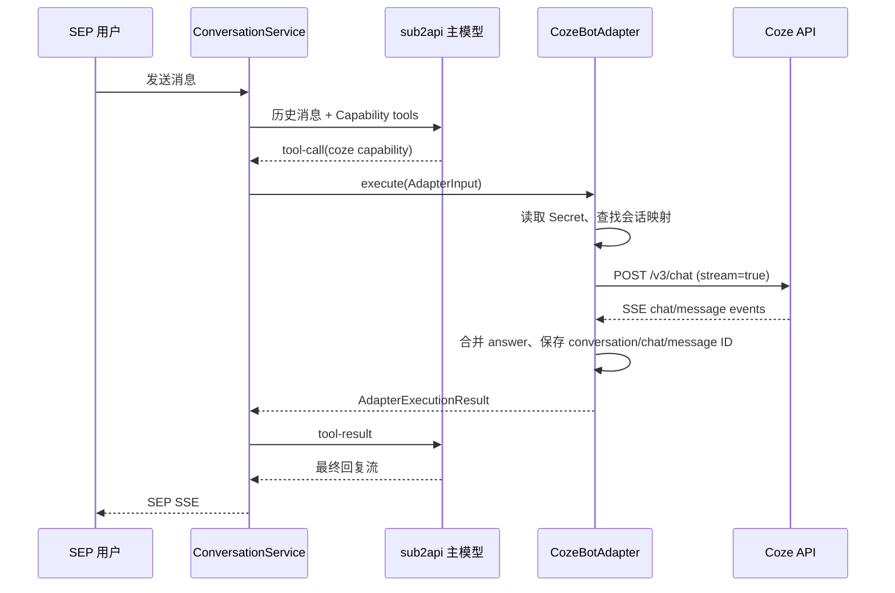

# Coze 官方 API 集成调研与方案

> 适用项目：硅基人才平台（SEP）
> 调研日期：2026-07-24
> 文档性质：集成调研与实施建议，不包含代码修改
> 结论基准：当前仓库实现优先，Coze 官方文档与官方 SDK 为外部依据

## 1. 文档目标

本文回答以下问题：

1. Coze 官方开放 API 能为 SEP 提供哪些接入方式；
2. Coze Bot、Workflow 与 SEP“硅基能力”的关系；
3. 当前仓库已有的 Coze 接入做到了什么；
4. 生产级接入还缺少哪些能力；
5. 后续实施时应如何分阶段设计、测试和验收。

本文不建议让前端直接调用 Coze。所有 Coze 请求都应经过 SEP 后端，由 Capability Adapter 层统一执行。

## 2. 核心结论

SEP 应采用“一个平台、多种运行类型”的方式集成 Coze：

```text
platform = COZE
runtimeKind = COZE_BOT_CHAT | COZE_WORKFLOW
```

推荐路线：

1. **第一阶段接 Coze Bot Chat API**：使用 `POST /v3/chat`，服务端通过 PAT 鉴权，默认采用 SSE 流式响应。
2. **第二阶段接 Coze Workflow API**：同步执行使用 `POST /v1/workflow/run`；需要边执行边返回时使用 `POST /v1/workflow/stream_run`。
3. **保持现有 Adapter 架构**：主模型通过 sub2api 判断是否调用能力，Coze 只作为被调用的外部能力执行器。
4. **不要把 Coze 设为 SEP 主模型供应商**：SEP 的主对话和能力编排继续通过 sub2api；Coze 是 Capability Provider，而不是绕过 sub2api 的通用模型入口。
5. **生产前优先解决安全问题**：当前 `AgentConfig.apiKey` 明文存储和返回风险高，必须改为加密密文或 Secret 引用。
6. **会话不能简单等同**：SEP `sessionId` 与 Coze `conversation_id` 应建立映射，而不是默认使用同一个值。

## 3. 官方能力概览

### 3.1 API 区域

Coze 的中国区和国际区是不同的资源环境：

| 区域 | API Base URL | 典型场景 |
|---|---|---|
| 中国区 | `https://api.coze.cn` | Bot、Workflow 和凭据均创建在 Coze 中国区 |
| 国际区 | `https://api.coze.com` | Bot、Workflow 和凭据均创建在 Coze 国际区 |

Bot ID、Workflow ID、访问凭据和 Base URL 必须属于同一区域。SEP 不应允许贡献者任意填写完整 API URL，而应提供 `CN`、`GLOBAL` 等受控区域选项，再由后端映射到白名单地址。

### 3.2 鉴权方式

Coze 官方 SDK 支持 Personal Access Token（PAT）和 OAuth JWT 等鉴权方式。

SEP 的 MVP 推荐使用 PAT：

```http
Authorization: Bearer {COZE_PAT}
Content-Type: application/json
```

适用原因：

- SEP 是服务端到服务端调用；
- Coze Bot/Workflow 由平台或贡献者托管；
- 终端用户不需要拥有 Coze 账号；
- 接入成本低，适合先完成内部能力市场闭环。

PAT 不能进入浏览器、前端状态、API 响应、错误日志或工具调用参数。未来如果要让每个 SEP 用户授权自己的 Coze 账号，再单独引入 OAuth，不应在 MVP 中同时支持多套鉴权。

### 3.3 Bot Chat API

核心接口：

```http
POST {COZE_API_BASE}/v3/chat
```

典型请求：

```json
{
  "bot_id": "bot_xxx",
  "user_id": "sep_user_xxx",
  "stream": true,
  "auto_save_history": true,
  "additional_messages": [
    {
      "role": "user",
      "content": "请分析这份产品需求",
      "content_type": "text"
    }
  ]
}
```

如果继续已有 Coze 会话，可以附带 `conversation_id`。如果没有 Coze 会话，调用完成后应保存响应中的 Coze 会话标识，供下一轮继续使用。

主要字段映射：

| Coze 字段 | SEP 来源 | 建议 |
|---|---|---|
| `bot_id` | Capability 的外部资源配置 | 必填，审核时校验 |
| `user_id` | SEP 用户稳定匿名标识 | 不直接使用邮箱、手机号或姓名 |
| `conversation_id` | Provider Session 映射 | 不直接等同于 SEP session ID |
| `additional_messages` | 当前能力调用输入 | 默认仅发送当前必要信息 |
| `stream` | Adapter 固定配置 | MVP 推荐 `true` |
| `auto_save_history` | 能力配置或平台策略 | 需结合数据保留政策决定 |
| `custom_variables` 等扩展参数 | `AdapterInput.extraParams` | 只能传白名单字段 |

### 3.4 Chat SSE 事件

Coze `/v3/chat` 的流式响应不是简单的文本流，而是 SSE 事件流。官方 SDK暴露的事件类型包括：

- `conversation.chat.created`
- `conversation.chat.in_progress`
- `conversation.message.delta`
- `conversation.message.completed`
- `conversation.chat.completed`
- `conversation.chat.failed`
- `conversation.chat.requires_action`
- `error`
- `done`

SEP 解析时应遵守以下原则：

1. 只有消息类型为 `answer` 的 assistant 内容才进入最终文本；
2. `conversation.message.delta` 用于追加增量；
3. `conversation.message.completed` 用于确认完整消息，但不能重复追加已经累计的 delta；
4. `conversation.chat.completed` 才能证明整个调用正常完成；
5. `requires_action` 表示 Coze 需要外部工具结果，不能被当作普通回答；
6. `error`、`failed` 或未收到完成事件就断流，应返回失败或不确定状态；
7. `[DONE]` 或 `done` 只负责结束读取，不能替代业务完成判断。

### 3.5 非流式 Chat

当 `stream: false` 时，创建 Chat 通常只返回 Chat 对象。调用方可能还需要：

1. 查询 Chat 状态；
2. 等待状态完成；
3. 查询该 Chat 的消息列表；
4. 提取 `type = answer` 的 assistant 消息。

因此，SEP MVP 更适合直接使用流式调用，避免额外轮询，同时获得更低的首字延迟。

### 3.6 Conversation API

Coze 提供 Conversation 相关 API 和 SDK 方法，用于创建会话、追加消息和读取消息。

SEP 不建议把 Coze Conversation 作为全平台的消息真相源。SEP 自己已经有：

- `ConversationSession`
- `Message`
- 会话归属校验
- Redis 会话锁
- 主模型与工具调用历史

合理分工是：

```text
SEP Conversation = 产品级完整对话真相源
Coze Conversation = 某个 Coze Capability 的供应商侧上下文
```

### 3.7 Workflow API

同步执行接口：

```http
POST {COZE_API_BASE}/v1/workflow/run
```

流式执行接口：

```http
POST {COZE_API_BASE}/v1/workflow/stream_run
```

典型输入：

```json
{
  "workflow_id": "workflow_xxx",
  "parameters": {
    "product_name": "硅基人才平台",
    "target_user": "企业运营人员"
  }
}
```

Workflow 和 Bot 必须区分：

| 项目 | Bot Chat | Workflow |
|---|---|---|
| 外部资源 ID | `bot_id` | `workflow_id` |
| 输入形式 | 用户消息和会话上下文 | Workflow 参数对象 |
| 输出形式 | assistant answer | JSON、文本、节点输出、文件引用等 |
| 上下文 | 通常支持 conversation | 由 Workflow 自身定义 |
| 长任务 | Chat 生命周期 | 可能存在异步或长耗时执行 |
| SEP 适配器 | `CozeBotAdapter` | `CozeWorkflowAdapter` |

不要在现有 `CozeAdapter` 内通过判断有没有 `workflowUrl` 来猜运行类型。运行类型应显式配置。

## 4. 当前仓库实现评估

### 4.1 已有实现

当前仓库已经存在以下基础：

| 文件 | 已有能力 |
|---|---|
| `backend/src/modules/capability/adapters/adapter.interface.ts` | 统一 `execute()` 输入输出 |
| `backend/src/modules/capability/adapters/coze.adapter.ts` | 中国区 `/v3/chat` 流式调用 |
| `backend/src/modules/capability/adapters/adapter.factory.ts` | 根据 `platform = COZE` 创建适配器 |
| `backend/src/modules/capability/capability.service.ts` | 从数据库读取 AgentConfig 后执行 |
| `backend/src/modules/conversation/conversation-stream.service.ts` | 主模型工具调用和结果回填 |
| `backend/prisma/schema.prisma` | `AgentConfig` 保存 Coze Bot 配置 |
| `backend/src/shared/index.ts` | 上传 DTO 已允许 `platform = coze` |

现有调用链符合 SEP 的 Adapter 架构：

```text
用户消息
  -> SEP 主模型（通过 sub2api）
  -> 主模型决定调用某个 Capability
  -> CapabilityService.execute()
  -> AdapterFactory
  -> CozeAdapter
  -> Coze API
  -> 归一化工具结果
  -> SEP 主模型生成最终回答
```

这个边界应保留。

### 4.2 当前适配器的问题

#### 问题 1：SSE 事件解析不完整

当前解析逻辑主要判断：

- `event.type === 'answer'`
- `event.delta`
- `event.content && event.role === 'assistant'`
- `[DONE]`

但 `/v3/chat` 的核心事件类型位于 SSE `event:` 字段中。生产实现必须同时解析 SSE event name 和 data payload，并区分 delta、completed、failed、requires_action 与 done。

#### 问题 2：完整消息可能覆盖增量结果

当前逻辑遇到完整 assistant 内容时执行覆盖：

```text
output = event.content
```

这可能掩盖多条 answer 消息，也可能在事件字段变化时丢失内容。更稳妥的方式是按 `message_id` 管理消息缓冲，最后按消息顺序合并 `type = answer` 的内容。

#### 问题 3：SEP session ID 被直接当成 Coze conversation ID

当前请求使用：

```text
conversation_id = input.sessionId
```

这隐含假设两个系统使用同一标识和生命周期。应改为 Provider Session 映射，否则可能产生非法 ID、上下文丢失、能力切换串话或 Bot 版本变化后的会话污染。

#### 问题 4：PAT 明文存储

`AgentConfig.apiKey` 当前直接保存凭据，并通过包含 `agentConfig` 的查询返回数据。生产环境必须避免：

- PAT 出现在 Capability 列表和详情响应；
- PAT 被贡献者或管理员前端缓存；
- PAT 出现在日志、异常堆栈或审计 payload；
- 数据库泄漏后可直接调用 Coze。

#### 问题 5：配置模型只支持 Bot

当前 `AdapterConfig` 只有 `botId`，没有：

- `runtimeKind`
- `workflowId`
- `region`
- `credentialRef`
- `requestTimeoutMs`
- Workflow 参数映射

因此现有结构只能视为 Bot MVP 雏形。

#### 问题 6：错误语义过于简单

当前适配器把所有异常压成：

```json
{
  "success": false,
  "output": "",
  "error": "原始异常消息"
}
```

生产实现需要区分配置、鉴权、限流、请求参数、服务端失败、断流、超时、取消和业务执行失败。

## 5. 推荐目标架构

### 5.1 Adapter 分层

```text
CapabilityService
  -> AdapterFactory
      -> CozeBotAdapter
          -> CozeClient / HTTP Client
      -> CozeWorkflowAdapter
          -> CozeClient / HTTP Client
      -> OpenCodeAdapter
      -> future adapters
```

建议把 Coze 公共逻辑提取为轻量客户端或基类，只复用：

- Base URL 白名单映射；
- Authorization header；
- 超时和取消；
- HTTP 错误转换；
- LogID、请求 ID 和限流头提取；
- 脱敏日志。

Bot 与 Workflow 的请求、事件和输出归一化应保持独立。

### 5.2 目标配置模型

建议配置能够表达：

```text
platform: COZE
runtimeKind: BOT_CHAT | WORKFLOW
region: CN | GLOBAL
externalResourceId: bot_id | workflow_id
credentialRef: secret://...
requestTimeoutMs: number
autoSaveHistory: boolean
parameterMapping: Json
outputMapping: Json
```

如果后续允许一个 Capability 对应多个 Coze 版本，还应记录：

- Coze 资源发布版本或快照；
- 最近一次验证时间；
- 最近一次验证结果；
- 资源所有者或工作空间；
- API 契约 hash。

### 5.3 Provider Session 映射

建议逻辑模型：

```text
ProviderConversation
  id
  sessionId
  capabilityId
  provider = COZE
  externalResourceId
  externalConversationId
  lastChatId
  createdAt
  updatedAt
```

建议唯一约束：

```text
sessionId + capabilityId + externalResourceId
```

这样即使同一个 SEP 会话调用多个 Coze 能力，也不会共享错误的供应商上下文。

### 5.4 输入映射

SEP 的 `inputSchema` 是主模型工具契约，不应完全暴露 Coze 内部 schema。

推荐流程：

```text
AI SDK tool args
  -> Zod/JSON Schema 校验
  -> Capability parameterMapping
  -> Coze Chat message 或 Workflow parameters
```

Bot 示例：

```json
{
  "inputSchema": {
    "type": "object",
    "required": ["question"],
    "properties": {
      "question": {
        "type": "string",
        "description": "需要交给 Coze Bot 处理的问题"
      }
    }
  },
  "mapping": {
    "question": "additional_messages[0].content"
  }
}
```

Workflow 示例：

```json
{
  "inputSchema": {
    "type": "object",
    "required": ["productName"],
    "properties": {
      "productName": {"type": "string"}
    }
  },
  "mapping": {
    "productName": "parameters.product_name"
  }
}
```

### 5.5 输出归一化

建议统一结果扩展为：

```json
{
  "success": true,
  "output": "面向主模型的文本或 JSON",
  "durationMs": 1240,
  "rawResponse": {
    "provider": "coze",
    "runtimeKind": "BOT_CHAT",
    "conversationId": "conversation_xxx",
    "chatId": "chat_xxx",
    "messageIds": ["message_xxx"],
    "logId": "provider-log-id"
  }
}
```

`rawResponse` 只能保存必要的非敏感元数据，不应保存 PAT、Authorization header 或未经审批的完整用户输入。

## 6. Bot Chat 执行流程

推荐时序：



重要设计决策：

- **MVP 不把 Coze 的 token delta 直接透传给终端用户**。Coze 是主模型的一次工具调用，先完成工具执行，再让主模型结合上下文生成最终回复。
- 如果产品未来希望直接展示 Coze 输出，需要增加“直通能力模式”，不能复用当前主模型工具循环的语义。
- 同一 SEP session 已有 Redis 锁，可防止同时执行多个主对话轮次；Provider Session 映射仍需数据库级唯一约束。

## 7. Workflow 执行流程

Workflow 应按照执行时长分为两类：

### 7.1 短任务

- 调用 `/v1/workflow/run`；
- 在服务端总超时范围内等待结果；
- 按 `outputMapping` 转换为 SEP 输出；
- 返回主模型继续推理。

### 7.2 长任务

不建议让 `ConversationStreamService` 长时间阻塞等待。应引入异步执行记录：

```text
ProviderExecution
  id
  capabilityId
  sessionId
  providerExecutionId
  status
  requestHash
  result
  errorCode
  startedAt
  finishedAt
```

用户体验可以是：

1. 主模型发起 Workflow；
2. SEP 返回“任务已开始”；
3. 后台轮询或接收结果；
4. 结果写入消息或通知用户；
5. 用户继续追问时主模型可以读取结果。

## 8. 错误、重试和超时

### 8.1 错误分类

| 分类 | 示例 | 是否重试 | SEP 行为 |
|---|---|---:|---|
| `CONFIG_ERROR` | 缺少 Bot ID、区域不匹配 | 否 | 能力不可用，通知管理员 |
| `AUTH_ERROR` | PAT 无效、权限不足 | 否 | 禁用或标记凭据失效 |
| `VALIDATION_ERROR` | Workflow 参数不符合 schema | 否 | 返回可定位字段错误 |
| `RATE_LIMITED` | HTTP 429 | 有条件 | 遵守 `Retry-After`，有限退避 |
| `PROVIDER_UNAVAILABLE` | 5xx、连接失败 | 有条件 | 最多重试 1-2 次 |
| `TIMEOUT` | 超过总耗时 | 谨慎 | 记录不确定状态，避免盲目重复执行 |
| `STREAM_INTERRUPTED` | SSE 未完成就断开 | 谨慎 | 不伪造成功，保存已知执行 ID |
| `EXECUTION_FAILED` | Coze chat/workflow failed | 否 | 保存 Coze 错误码和 LogID |
| `ACTION_REQUIRED` | Chat requires_action | 取决于设计 | MVP 可明确不支持并失败 |

### 8.2 重试原则

- 不要对所有 POST 请求自动重试；
- 收到业务响应后不能因为结果不满意而重放；
- Workflow 可能包含发消息、写数据等副作用，更不能盲目重试；
- 对连接建立失败、明确 5xx、429 才做有限重试；
- 每次 SEP 调用生成唯一 `executionId`，用于日志、追踪和去重；
- 如果 Coze 提供可查询的 chat/run ID，应优先查询已有结果，而不是重新创建执行。

### 8.3 超时建议

应分别设置：

- DNS/连接超时；
- 首个 SSE 事件超时；
- 单次读取空闲超时；
- 整体执行超时；
- Workflow 长任务最大等待时间。

超时值应按不同 runtime kind 配置，不能让所有能力共享一个无限等待的默认值。

## 9. 凭据安全

### 9.1 推荐方案

```text
数据库保存 credentialRef
  -> 运行时从 Secret Manager/加密存储读取 PAT
  -> 内存中用于一次 Coze 请求
  -> 日志和响应永不输出 PAT
```

如果暂时没有独立 Secret Manager，最低要求是：

1. 使用应用级主密钥加密 PAT；
2. 主密钥只存在运行环境，不存数据库；
3. Capability 查询默认不 select 加密字段；
4. 管理接口只返回 `credentialConfigured: true`；
5. 凭据更新接口只支持覆盖，不支持读取原文；
6. 记录创建、更新、撤销和验证审计日志。

### 9.2 多租户隔离

- 贡献者只能使用自己创建或被授权的凭据；
- 管理员审核能力时也不应看到 PAT 原文；
- 不同贡献者的 Bot 不应共享同一 Provider Conversation；
- 全局平台 PAT 和贡献者自带 PAT 应使用不同的 credential owner 类型；
- 删除贡献者账号时要有凭据和能力的解绑/归档流程。

## 10. 数据和合规

调用 Coze 意味着用户数据会离开 SEP。上线前必须明确：

- 发送哪些消息、文件和业务字段；
- 是否发送完整会话历史；
- Coze 是否保存历史，保存多久；
- 哪些人员可以在 Coze 控制台查看数据；
- 中国区与国际区的数据驻留要求；
- 用户删除 SEP 会话时，是否需要同步删除供应商侧数据；
- 文件 URL 是否包含公开访问或长期签名。

默认策略应是数据最小化：

- `user_id` 使用不可逆或租户内稳定的匿名 ID；
- 不默认传邮箱、手机号、姓名；
- 不把 SEP 最近 20 条消息全部发送给 Coze；
- 仅发送当前 Capability 完成任务需要的字段；
- Provider 原始响应设置合理的日志留存期。

## 11. 可观测性

每次 Coze 调用建议记录：

```text
executionId
capabilityId
runtimeKind
region
externalResourceId（可部分脱敏）
sepSessionId
cozeConversationId
cozeChatId / workflowRunId
cozeLogId
httpStatus
providerErrorCode
durationMs
retryCount
success
startedAt / finishedAt
```

建议指标：

- 调用量；
- 成功率；
- P50/P95/P99 耗时；
- 首事件延迟；
- 429 比例；
- 401/403 比例；
- SSE 中断率；
- Workflow 超时率；
- 各能力的失败率和费用趋势。

官方 SDK可从响应中取得 LogID 时，应把它保存下来，便于在 Coze 平台定位问题。

## 12. 审核和运营流程

贡献者上传 Coze 能力时，建议增加以下审核步骤：

1. 选择区域和运行类型；
2. 填写 Bot ID 或 Workflow ID；
3. 提交 PAT，但提交后不可再次读取；
4. 后端执行只读连接验证；
5. 对测试输入执行一次沙箱调用；
6. 保存脱敏的验证结果和 LogID；
7. 管理员审核输入输出 schema、隐私范围和副作用；
8. 审核通过后才允许绑定数字员工；
9. 定期健康检查凭据、资源发布状态和响应契约；
10. 凭据失效时自动暂停能力，避免影响整个对话链路。

对 Workflow 还需额外审核：

- 是否会发送外部消息；
- 是否会修改或删除数据；
- 是否包含人工确认步骤；
- 是否可能长时间运行；
- 是否产生文件或敏感输出；
- 重试是否会造成重复副作用。

## 13. 分阶段实施建议

### Phase 0：官方控制台验证

目标：锁定真实 API 契约。

- 创建专用测试 Bot；
- 创建最小权限测试 PAT；
- 验证中国区 `/v3/chat`；
- 保存脱敏的完整 SSE 样本；
- 确认 `conversation_id` 创建和复用方式；
- 验证错误 Bot、失效 PAT、429 和超时；
- 创建测试 Workflow，验证同步和流式接口；
- 记录当前配额、错误码和数据保留规则。

### Phase 1：Bot Chat MVP

目标：让一个已审核 Coze Bot 稳定作为数字员工工具运行。

- 只支持中国区或一个明确区域；
- 只支持 PAT；
- 只支持 `COZE_BOT_CHAT`；
- 完善 SSE 事件解析；
- 建立 Provider Conversation 映射；
- 隐藏和加密 PAT；
- 增加超时、取消和错误分类；
- 增加单元测试和专用 Bot 联调测试。

### Phase 2：Workflow

目标：支持结构化和业务流程型能力。

- 新增 `COZE_WORKFLOW`；
- 新增 Workflow ID；
- 增加参数和输出映射；
- 支持同步与流式 Workflow；
- 对长任务增加 ProviderExecution 状态；
- 对有副作用的 Workflow 禁止自动重试。

### Phase 3：生产治理

- Secret Manager；
- 凭据轮换和健康检查；
- 配额与失败率告警；
- 成本和调用量统计；
- 数据删除和留存策略；
- Coze 资源版本/契约漂移检测；
- 多区域与多租户隔离。

## 14. 测试矩阵

| 场景 | 预期结果 |
|---|---|
| 有效 PAT、有效 Bot、单轮消息 | 返回 answer，保存 Coze 元数据 |
| 连续两轮调用同一 Capability | 复用正确 Provider Conversation |
| 同一 SEP session 调用两个 Coze Bot | 会话完全隔离 |
| 两个用户调用同一个 Bot | `user_id` 和会话不串租户 |
| PAT 失效 | 不重试，返回 `AUTH_ERROR`，标记凭据异常 |
| Bot ID 错误或未发布 | 返回配置/权限错误，不无限重试 |
| SSE JSON 被网络分片截断 | buffer 正确拼接，不丢字符 |
| 多条 answer 消息 | 按顺序合并，不互相覆盖 |
| 收到 completed 后又收到 done | 不重复追加内容 |
| SSE 中途断开 | 不返回伪成功，保留执行 ID |
| `requires_action` | MVP 明确返回不支持或进入受控工具流程 |
| 429 | 遵守 Retry-After，有限重试 |
| 5xx | 有界退避，超过次数后失败 |
| Workflow 参数缺失 | SEP 本地校验失败，不调用 Coze |
| Workflow 有副作用且超时 | 不自动重放，状态标记为不确定 |
| Capability 管理接口 | 永不返回 PAT 原文 |
| 日志和异常 | 不包含 Authorization 和敏感 payload |
| 区域与 Token 不匹配 | 审核或连接验证阶段阻止上线 |

## 15. 验收标准

### Bot MVP 必须满足

- 通过后端成功调用一个已发布 Coze Bot；
- 正确处理官方 Chat SSE 事件；
- 连续多轮会话上下文正确；
- SEP 用户之间不串会话；
- PAT 不出现在任何 API 响应和日志；
- 401、403、429、5xx、超时和断流均有可预测行为；
- 主模型可以收到稳定的 `AdapterExecutionResult`；
- Coze 故障不会破坏 SEP 会话锁或消息持久化；
- 可以使用 executionId、Coze LogID 和 Chat ID 定位一次调用。

### Workflow 上线前必须满足

- 显式区分 Bot 和 Workflow；
- 输入参数通过 schema 校验；
- 输出通过映射后符合 SEP outputSchema；
- 长任务不会无限阻塞主对话；
- 有副作用的执行不会被自动重复提交；
- Workflow 版本或契约变化能够被发现。

## 16. 不建议的做法

- 前端直接携带 PAT 调用 Coze；
- 把 PAT 存在 `localStorage`；
- 在 Capability 查询结果中返回 `apiKey`；
- 允许贡献者填写任意 Coze API Base URL；
- 直接把 SEP session ID 当作 Coze conversation ID；
- 把所有 SSE `data:` 都拼成答案；
- 对所有 POST 失败自动重试；
- 把 Bot 和 Workflow 塞进同一个大量条件分支的 Adapter；
- 让 Coze 绕过 sub2api 成为 SEP 的主模型调用入口；
- 未经审核把完整会话、用户身份和文件发送到 Coze。

## 17. 推荐最终方案

当前阶段建议采用：

```text
第一优先级
  Coze Bot Chat
  + POST /v3/chat
  + 服务端 PAT
  + SSE 事件解析
  + Provider Conversation 映射
  + Secret 安全存储

第二优先级
  Coze Workflow
  + /v1/workflow/run
  + /v1/workflow/stream_run
  + 参数/输出映射
  + 异步执行状态

持续治理
  + 凭据轮换
  + LogID/执行追踪
  + 限流和配额告警
  + 数据合规
  + 契约漂移检测
```

现有 `CozeAdapter` 是可用的技术验证起点，但还不是生产完成状态。最先需要解决的不是增加更多 Coze 功能，而是：

1. 按官方事件模型重写 SSE 解析；
2. 保护 PAT，禁止通过数据库查询和接口返回明文；
3. 建立 SEP 与 Coze 的会话映射；
4. 增加超时、错误分类、LogID 和执行追踪；
5. 将 Bot 与 Workflow 显式拆分。

## 18. 官方资料

以下资料在 2026-07-24 调研时用于核验接口和 SDK 能力。正式实施时应再次检查官方最新版本和变更记录。

- Coze 中国区开放平台：<https://www.coze.cn/open>
- Coze 中国区开发文档：<https://www.coze.cn/docs/developer_guides>
- Coze 国际区开发文档：<https://www.coze.com/docs/developer_guides>
- Coze API JavaScript SDK：<https://github.com/coze-dev/coze-js>
- Coze API Python SDK：<https://github.com/coze-dev/coze-py>
- JavaScript SDK Bot Chat 示例：<https://github.com/coze-dev/coze-js/tree/main/examples/chat>
- JavaScript SDK Workflow 示例：<https://github.com/coze-dev/coze-js/tree/main/examples/workflows>

上线前重点复核：

- PAT 创建、权限和有效期；
- 中国区/国际区 Base URL；
- `/v3/chat` 最新请求字段和 SSE 事件；
- `requires_action` 的官方处理方式；
- `/v1/workflow/run` 与 `/v1/workflow/stream_run` 的当前契约；
- 限流、配额、错误码和 Retry-After；
- Conversation、Chat 和 Workflow 的数据保留与删除规则；
- 官方 SDK 的兼容 Node.js 版本和最新发布版本。
