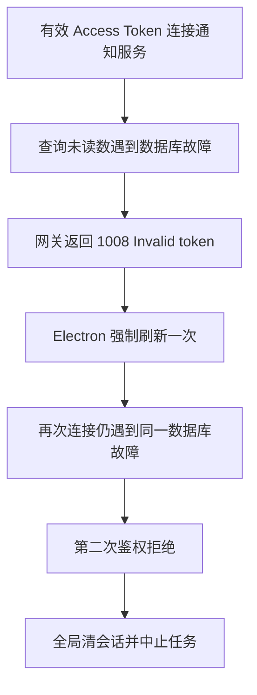

# 通知模块客户端对接故障调研与优化方案

日期：2026-10-10

范围：SEP 通知服务、Electron 客户端、平台 Web 通知消费链路

性质：源码调研、实施方案与修复记录。本轮已实施服务端、Electron 和平台 Web 修复；真实部署联调尚未完成，详见第 10 节。

## 1. 结论与优先级

**当前最需要解决的是“通知故障影响登录会话”和“推送、列表、未读数不一致”。原交接文档部分内容已落后于当前源码，不能按其中的修复状态直接安排上线。**

以下第 1～9 节记录修复前的调研事实和方案，不作为修复后的现状描述。当前实施及验证状态以第 10 节为准。

修复前已核实的关键事实：

1. 服务端已经允许没有 `Origin` 的原生连接，已经直接处理 `{type: "ping"}`，已经统一 Access Token 密钥选择。三项仍需部署验收，但不能继续认定为当前源码中的连接阻断。
2. 服务端仍将未读数数据库查询失败关闭为 `1008 / Invalid token`；批量通知仍推送创建参数，缺少真实 `id`、`read`、`createdAt`。
3. **本机 Electron 客户端仍会在刷新成功后第二次通知鉴权拒绝时触发全局会话清理。** 源码及测试均如此，与原交接文档“已修复、不登出”的描述相反。这条误登出链路仍可由服务端内部故障触发。
4. 平台 Web 另有独立问题：重复连接 effect、旧连接回调干扰新连接、重连只补未读数而不补列表，以及未读数写入错误的 Query Key。
5. 通知落库与在线推送的失败边界没有分开；数据已经写入后，后续推送或计数失败仍可让调用方收到异常。部分业务入口已有保护，不能据此认定所有入口都已隔离。

建议沿用现有 `REST + WebSocket + HTTP 补偿` 架构，分三阶段修复：

| 阶段 | 目标 | 主要工作 |
| --- | --- | --- |
| P0：本轮故障修复 | 消除误登出、错误认证分类和不完整通知推送 | 服务端错误分类、认证一致性、批量完整记录；Electron 通知与会话失效解耦 |
| P1：紧接本轮 | 恢复稳定连接及列表、角标一致性 | Web 生命周期与 Query Key、重连补偿、推送失败隔离、暂时故障恢复、错误展示 |
| P2：有实际需求后 | 支撑并发和多实例 | 批量计数优化、分页稳定性、条件式跨实例分发、必要时持久重试 |

P0/P1 不要求引入新的消息中间件，不新增 `/client/notifications`，不迁移到 Socket.IO，不更换有效的现有密钥。

## 2. 调研依据与证据边界

### 2.1 本次检查的实际目录

| 对象 | 本地目录／文档 | 版本边界 |
| --- | --- | --- |
| SEP 服务端与 Web | `/Users/yao/LLM/SEP` | HEAD `ff57747`，同时存在其他工作中的未提交修改；结论基于读取时工作区源码 |
| Electron 客户端 | `/Users/yao/LLM/sep-client` | HEAD `907b5e2`；结论基于本机源码，不代表 Windows 交接目录或已发布安装包 |
| 原故障交接 | `docs/对接/通知模块故障与服务端修复交接-2026-10-10.md` | 其中检查目录为 `D:/github/sep-client`、`D:/github/SEP-main` |
| 通知接口文档 | `docs/对接/SEP客户端通知接口对接文档-v1.md` | 已描述原生客户端可缺少 Origin，但部分认证失败处理仍需澄清 |

当前源码、测试期望、部署镜像和客户端安装包是四种不同证据。本文不推断线上正在运行哪个版本，也不把两份不同机器上的源码当成同一修复版本。

### 2.2 实际调用链

服务端：`业务模块 → NotificationsService → Prisma 持久化 → NotificationsGateway → 用户在线连接`。

Electron：`NotificationService → platform-api / NotificationSocket → 主进程事件 → renderer use-notifications → 列表与角标`。

平台 Web：`NotificationBell → use-realtime → hooks/use-websocket → /ws/notifications`；HTTP 查询由 `features/notifications/use-notifications.ts` 管理。`web/src/lib/websocket.ts` 的另一套同名 hook 不是当前通知铃铛使用的链路，修复时应定位实际调用者。

## 3. 与原交接文档逐项对照

| 问题 | 原交接描述 | 当前核验 | 下一步 |
| --- | --- | --- | --- |
| 缺少 Origin 被拒绝 | 必须给 Electron 补 Origin | `notifications.gateway.ts:53` 仅在 Origin 存在且不在白名单时拒绝 | 保留当前兼容策略；同步验收口径，核实部署版本 |
| 心跳不进入 handler | 默认 WsAdapter 按 `event` 路由，客户端发 `type` | 网关 `:65` 自行监听 message，认证后 `:70` 直接处理 `type: ping` | 不再重复修改路由；补真实适配器联调 |
| 通知 JWT 密钥不一致 | 通知仅使用 JWT_SECRET | 网关 `:182`、模块 `:17` 均优先 ACCESS_JWT_SECRET，回退 JWT_SECRET | 使用不含真实密钥的测试配置验证规则；生产只核对一致性 |
| DB 异常误报 Token 无效 | 必须拆分异常处理 | `notifications.gateway.ts:89` 查询与验证仍在同一 catch，`:92` 统一返回 Invalid token | P0 修复 |
| 批量通知缺字段 | 推送创建参数而非数据库记录 | `notifications.service.ts:63` createMany，`:68` 推送入参 | P0 修复 |
| Access Token 类型校验 | 应校验 access、sub、用户状态 | `gateway.ts:81` 已查 type，但仅检查 sub 真值，未查有效用户 | P0 补齐，与 REST 同等要求 |
| Electron 重复鉴权不登出 | 文档称本地已完成 | 当前 REST、WS 都在第二次拒绝后回调全局清理，相关测试还明确要求该行为 | P0 同时改逻辑与测试预期；先明确版本差异 |
| 重连后 HTTP 补偿 | 客户端已完成 | Electron 已实现；平台 Web 的 connected 分支只失效未读数 | Electron 做端到端验收，Web 补齐列表刷新 |

**Origin 策略必须明确选定。** 本方案采用当前代码的兼容策略：没有 Origin 时继续 JWT 认证，有 Origin 时执行白名单校验。原生客户端可以自行设置该头，Origin 不能作为设备身份凭据。若以后决定恢复“所有连接必须有 Origin”，需单独协调客户端参数、允许值、代理、测试和发布顺序，不能在本轮服务端修复中悄悄改回严格模式。

## 4. 故障机制与影响

### 4.1 内部错误与全局会话清理组成误登出链路

服务端 `backend/src/modules/notifications/notifications.gateway.ts:65` 的 message handler 将 JSON 解析、JWT 验证、连接登记和未读数查询放在同一 catch 中。有效 Token 下的数据库异常会变成 `1008 / Invalid token`。

Electron 的实际处理为：

- REST：`electron/service/notification-service.ts:61` 首次 401 强制刷新；第二次 401 到外层 `:78`，执行 `stop()` 和 `onAuthenticationRequired()`。
- WS：`electron/common/platform/notification-socket.ts:206` 将 `4401` 或精确的 `1008 / Invalid token`、`Authentication required` 视为鉴权拒绝；`:278` 在已经刷新过后执行 `requireAuthentication()`。
- 两者在 `electron/bootstrap/build-backend.ts:95`、`:101` 都接到 `invalidateAuthentication()`；该函数 `:324` 中止运行任务，最终 `:349` 清认证、`:350` 通知 renderer 回登录页。
- REST 测试 `notification-service.test.ts:47` 和 WS 测试 `notification-socket.test.ts:504` 明确断言第二次拒绝会失效认证。



本次用 mock JWT verifier 和 mock 数据库异常执行了局部诊断，确认有效载荷进入未读数查询后，异常被映射为 `1008 / Invalid token`。它证明错误映射存在，不是线上数据库故障的复现。

### 4.2 批量落库成功，实时单条推送却不符合合同

`createBatch()` 的 `createMany()` 返回数量，之后推送 `{...notification, userId, category, severity}`，没有数据库生成的 ID、时间和已读状态。

Electron `src/shared/notification-contracts.ts:4` 要求 `id/read/createdAt` 等字段。`notification-socket.ts:227` 对消息做 safeParse，失败后直接返回。这意味着无效的 notification 事件本身不会触发补偿；之后合法的 unread_count 事件才可能推动 HTTP 重取。因此这是实时载荷失效，不能直接宣称数据库通知丢失，也不能把后续补偿当成协议正确的证明。

平台 Web 当前 notification 分支主要失效 HTTP 查询，不直接插入该不完整对象，因此影响形态与 Electron 不同。后续若直接消费 WS 内容，现有类型断言不能替代运行时校验。

### 4.3 认证要求仍未与 REST 完全一致

REST `backend/src/modules/auth/jwt.strategy.ts:22` 要求 `type === access`、字符串 sub，并调用 `AuthService.validateUser()`；后者 `auth.service.ts:748` 只返回 ACTIVE 用户。

通知网关目前只检查 `type` 和 sub 的真值，不查用户状态。局部 mock 诊断确认数字 sub 也会进入 `countUnread()`。此诊断不意味着能伪造 JWT 签名；它证明 payload 校验和用户验证缺失。用户禁用后也不应继续获得新通知订阅资格。

另外，网关只在连接初次验证 JWT，没有显式处理长期连接跨越 exp 后的认证寿命。这属于连接授权边界，建议在 P1 明确；不应假设一次认证等于永续授权。

### 4.4 平台 Web 的连接与缓存问题

| 问题 | 证据 | 可见影响 |
| --- | --- | --- |
| 两个重复连接 effect，加上独立重连 effect | `web/src/hooks/use-websocket.ts:156`、`:167`、`:182` | 创建连接后立即替换；重连计数改变还会重复触发清理与建连 |
| connect 依赖 reconnectCount，onopen 又重置计数 | 同文件 `:89`、`:142` | 刚恢复连接可能因回调身份变化再次被 effect 关闭 |
| 旧 socket 回调没有实例／代次守卫 | 同文件 `:119` | 旧 onclose 可能清掉新连接心跳、设置错误连接状态或额外调度重连 |
| connected 只失效未读数 | `web/src/hooks/use-realtime.ts:63` | 断线后角标恢复，列表仍可能保持旧快照 |
| WS 与 HTTP count 使用不同 Query Key | `use-realtime.ts:75` 对比 `features/notifications/use-notifications.ts:49` | WS 写入短 key，实际铃铛订阅带第三项的 key，不会直接更新 |
| onopen 就标记已连接，忽略 close code/reason，没有 pong 超时检测 | `hooks/use-websocket.ts:89`、`:102`、`:119` | 传输已打开与认证就绪混淆，认证拒绝、主动替换与网络断开难以正确区分 |

具体 key：HTTP 全局未读查询为 `['notifications', 'unread-count', undefined]`，WS 写入 `['notifications', 'unread-count']`。`setQueryData` 写的是一个具体 key；`invalidateQueries` 可以匹配前缀，两者的效果不能混用。

列表设置 staleTime 并不自动产生轮询。当前全局配置关闭窗口聚焦和挂载刷新，打开铃铛没有额外刷新，所以“过了十秒自然补齐列表”不是可靠的恢复策略。

### 4.5 通知落库之后的推送异常影响调用方

`NotificationsService.create()` 在落库后 await 推送和 count；`createBatch()` 在落库后 await 所有接收人的推送与 count。任何后续异常都可能向上抛出，即使通知记录已经存在。

controller 的已读、删除接口也在 mutation 完成后 await count 与推送；因此可能出现服务端已处理操作，客户端却收到失败响应的情况。

`capability-contribution.service.ts:139` 的 safeNotify/safeNotifyUsers 已为部分贡献流程隔离异常；`subscription-request.service.ts:167` 则直接 await 批量通知。不能将前者的保护范围推广到全部通知生产者。

### 4.6 刷新暂时失败仍有误清会话风险

平台 Web `web/src/lib/api-client.ts:78` 的 tryRefresh 把刷新 401、5xx、网络异常都压成 false；`:42` 的请求重试分支收到 false 后清认证。因此通知 HTTP 初次 401 后遇到刷新网络故障，仍可能让页面返回登录。

该清理只清 auth store，没有统一清 QueryClient；显式 logout 的清理更完整。此外，刷新成功无条件写回 auth，缺少会话代次检查，旧刷新结果可能晚于登出或新登录到达。

Electron 通知层已有 generation、用户及企业范围守卫；但 `AuthSessionManager` 的 refresh catch 仍需核对发起刷新时的会话代次，防止旧账号刷新失败清掉新账号。此项为源码风险，本次未做跨账号运行时复现。

## 5. 优化方案

### 5.1 P0：错误分类和认证流程

将流程划分为解析、验证 JWT、验证用户、初始化数据、登记连接五个阶段。使用明确的连接状态 `WAIT_AUTH → AUTHENTICATING → READY → CLOSED`，AUTHENTICATING 时防止重复 auth 并发进入初始化。

| 情况 | 建议对外行为 | 是否强刷 Access Token／清全局会话 |
| --- | --- | --- |
| JSON 或消息结构不合法 | `1008 / Invalid message`；单独记录协议错误 | 不因协议错误刷新或清会话 |
| 缺少 auth/token | 保持 `1008 / Authentication required` | 最多一次受控获取有效 Token；仍失败仅降级通知 |
| Token 过期／签名无效／非 access／sub 非法 | 保持 `1008 / Invalid token` | 最多一次刷新；重复通知拒绝不能独立决定全局登出 |
| 用户不存在／非 ACTIVE | 认证拒绝；具体原因记安全日志，避免枚举账户 | 后续登录会话有效性由认证层判断 |
| Origin 存在且不允许 | 保持 `1008 / Origin not allowed` | 不刷新、不登出，显示配置异常并降低重试频率 |
| 用户查询／未读数查询／内部处理异常 | `1011 / Internal error` | 退避重连，不刷新、不登出 |
| 认证五秒超时 | 保持 `1008 / Authentication timeout` | 按连接认证超时处理，不直接认定 Refresh Token 失效 |

实施要点：

- 复用现有 AuthService 的用户验证能力，或提取小范围的 Access Token 验证 service，HTTP 与 WS 共用；保持 Nest 模块依赖清晰，不在网关新建 PrismaClient。
- 使用现有 `ACCESS_JWT_SECRET ?? JWT_SECRET` 规则，不改变 Token 类型枚举、签发算法或有效期。
- 所有 await 返回后检查连接是否仍有效。完成用户校验和初始未读数查询后，再登记到可推送集合并发送 connected；中间错过的变化由 connected 后 HTTP 补偿覆盖。
- 用户查询失败是内部错误；查询成功但用户无效才是认证拒绝，不能把查询异常和无效用户合并。
- 关闭和断开走同一幂等清理逻辑，清理计时器、连接索引和初始化状态；close/send 自身异常也不能再次被改写为 Invalid token。
- 日志记录 stage、connectionId、错误类及安全上下文，不记录原始 Token、刷新凭据、密钥或整条 auth 消息。

### 5.2 P0：Electron 通知故障与登录会话解耦

**需要修改当前实现和测试，不能仅在文档中宣布已完成。**

- 通知 REST 首次明确 401：走认证管理器已有的去重刷新，重试一次；再次 401：返回通知服务鉴权异常，进入通知降级，保留登录会话和运行中的任务。
- WS 首次明确 Token 拒绝：最多强刷一次；再次拒绝：进入退避或暂停自动尝试并提供手动重试，不调用 `invalidateAuthentication()`。
- 保留网络、心跳超时、1011、Origin 拒绝与 Token 拒绝的区别，不让前几类消耗强刷额度。
- “刷新已尝试”的预算不能每次连接刚成功就无限重置；可在持续稳定一段时间、新会话或确实自然更新的 Token 后重置，避免抖动故障不断轮换 Refresh Token。
- 只有认证管理器确认 Refresh Token 过期、撤销或刷新端点明确拒绝时，才走全局认证失效；网络超时、DNS、5xx 保留会话，标记暂时无法刷新。
- REST 请求和 WS 重连同时发生时共用刷新 in-flight，避免重复 rotation。
- 调整 `notification-service.test.ts:47`、`notification-socket.test.ts:504` 的旧预期：重复通知拒绝应保留会话；另外新增真正刷新失效仍退出的正向安全用例。

这项修改应限定在通知错误语义和认证管理器结果分类，不改变员工运行 Token、任务接口或模型网关协议。

### 5.3 P0：批量推送真实持久化记录

优先使用当前 Prisma Client 的 `notification.createManyAndReturn()`：本机实际安装版本为 `6.19.3`，已生成的 NotificationDelegate 包含该方法，数据库为 PostgreSQL。本次未真实执行 SQL，实施时仍需针对测试数据库验证生成和返回行为。Prisma v6 官方资料确认该能力适用于 PostgreSQL，返回顺序不保证与输入一致。[R3]

推荐步骤：

1. 去除空接收人、去重 userIds；空集合直接返回 `{count: 0}`。
2. 对每位接收人执行统一 enrich；批量创建并取得实际记录。
3. 使用统一 serializer 输出记录，单条 create、批量 create、HTTP list 使用相同字段与空值规则。
4. 按每条记录的 `userId` 分发，不能将返回数组下标与输入接收人下标强行对应。
5. 完成提交后才推送；外部仍返回现有 `{count}` 形状，避免改变调用者合同。
6. 对每个接收人的推送结果隔离处理，记录失败并允许 HTTP 恢复。

不采用“查询最近 N 条通知再猜接收人”的方法，避免并发批次串数据。若目标环境不支持返回记录，备选方案是使用现有 PrismaService 的事务逐条 create 并取返回值；较大批次应控制规模。不能造一个与数据库记录不对应的临时 ID。

### 5.4 P1：分离持久化成功和实时投递成功

- notification 写入失败：按调用者既定业务语义处理；不能吞掉真正的数据库写入故障。
- 通知已经持久化，但在线发送或后续 count 失败：记录内部投递／同步错误，返回已完成的持久化结果；写 API 的已读、删除成功后也应保持相应成功语义。
- 在 NotificationsService 收敛通知 mutation 后同步，controller 保留 HTTP、Swagger、输入校验职责，避免各 controller 自己重复“修改 → count → push”。
- 一个 socket 发送失败不应中断该用户其他 socket，也不应拖垮其他接收人；发送回调、readyState 与必要的缓冲上限需要明确处理。
- 在线推送采用尽力送达，HTTP 为事实来源；新失败日志可追踪，但本轮不承诺逐条消息必达。

若产品未来要求“业务提交后通知必须最终生成、推送可自动重放”，再设计与业务事务同提交的 outbox 和持久重试。不能声称仅加 try/catch 或 Redis Pub/Sub 就获得必达保证。

### 5.5 P1：平台 Web 修复顺序

1. **生命周期先收敛。** 只保留一个连接 effect 和一个重连调度器；重试次数保存在 ref，避免计数变化改写 connect 身份；回调引用最新处理函数，防止业务回调更新引发建连。
2. **连接实例隔离。** 每次建立连接使用递增 connectionGeneration 或比较 socket 实例；旧 onopen/onmessage/onclose/onerror 均不得改变新连接状态、定时器或重连安排。卸载、登出、Token 替换属于主动关闭；不能只凭收到 1000 就忽略服务端意外关闭。
3. **认证就绪才在线。** onopen 发送 auth，收到 connected 后进入 READY、启动心跳和 HTTP 补偿；增加认证等待超时和 pong 超时检测。
4. **分类刷新。** connected 后失效整个通知前缀，至少恢复当前列表与全局未读数；notification、unread_count 变化也合并调度列表与相关分类 count 的 HTTP 同步，覆盖多设备已读／删除。
5. **统一 key 工厂。** 全局 count 用统一规范 key，分类 count 有明确类别。WS count 只更新全局 key，不覆盖分类 count；分类查询通过失效重取。失效前缀与精确写入分开封装。
6. **刷新结果有类别。** 认证层返回成功、确认失效、暂时失败，只有确认失效清登录；WS 仍使用一次受控强刷，不能单独决定全局退出。
7. **清理与响应隔离。** 登录账号变化、明确退出统一取消旧查询、关闭旧连接、清除用户相关缓存；刷新结果按会话代次检查后写回。
8. **可见反馈。** 查询失败不能显示为“暂无通知”或直接把角标置零；保留已知数据、提供重试，已读／删除失败有明确反馈。

无需本轮重写另一套未参与通知消费的 websocket hook。修复前先加连接生命周期和 Query Key 回归测试，避免以删除重复 effect 掩盖其他竞态。

### 5.6 P1：恢复能力与连接寿命

Electron 已有 30 秒心跳、10 秒 pong 等待、1～30 秒退避；保留这些参数，增加抖动并保证单个连接只有一个重试计划。平台 Web 与其保持一致的错误语义。

- 每次 connected 后执行 HTTP 补偿；合法事件和写操作完成后合并刷新，避免每条事件引起多次独立请求。
- Electron renderer 已读取当前页、全局 count、选中类别 count，已有 revision 防止旧快照覆盖新推送；在补偿连续失败后增加有界退避恢复，并在窗口恢复可见或打开通知面板时刷新。
- WS 不可用但 HTTP 可用时，可在通知面板活跃期间低频拉取列表与 count。使用已有未读轮询机制并统一调度，避免后台无限重复请求。
- 网络和内部错误显示“通知暂不可用／正在重连”；Origin 或重复通知鉴权失败显示可定位的配置／鉴权问题，并限制高频尝试。
- 长连接到 Token exp 后应结束该授权连接，或在到期前通过既有刷新流程换连接；第一阶段优先选择重建连接，避免新增连接内 re-auth 协议。新增的到期计时器在所有关闭路径清理。
- 用户状态在初次连接校验；若需要禁用用户立即失去现有 WS 权限，补账号状态事件或受控定期验证，作为明确后续需求，不把初始校验描述为即时撤销全部连接。

## 6. 保持兼容的协议与合同

### 6.1 地址、身份与成功响应

| 项目 | 保持的合同 |
| --- | --- |
| REST | `/api/notifications` 及现有子路径；普通 Access Token Bearer 认证 |
| WS | `/ws/notifications`，不带 `/api`；Token 放首条 auth JSON，不放 URL |
| Web 刷新 | 当前实际为 `POST /api/auth/refresh`，refresh token 为 httpOnly cookie |
| Electron 刷新 | `POST /api/client/auth/refresh`，使用桌面端既有安全存储与 rotation 流程 |
| 写操作成功 | 已读、全部已读、删除、清已读仍为 `204 No Content` |
| 通知分类／类型 | 保持现有枚举，不因连接修复新增业务分类 |

注意：项目说明中出现过 GET refresh，但当前 controller 和 Web api-client 实际使用 POST，本文以源码为准，不把改 HTTP 方法作为通知优化的一部分。

Electron 当前 WS URL 转换已去掉末尾 `/api`，HTTP 204 也已按状态处理；这些不是本轮待修故障。部署仍需验证真实配置、子路径和代理。

### 6.2 消息合同

| 方向／类型 | 消息要点 |
| --- | --- |
| 客户端 auth | `{type: "auth", token: "<access-token>"}` |
| 服务端 connected | `{type: "connected", data: {unreadCount: 0}, timestamp: <毫秒>}` |
| ping / pong | 保留 `type: "ping"` 与 `type: "pong"`，不改为 event 路由 |
| notification | data 为数据库对应的完整通知记录 |
| unread_count | `{type: "unread_count", data: {count: 0}, timestamp: <毫秒>}`；count 是全局未读 |

notification.data 必含：`id`、`type`、`title`、`message`、`read`、`category`、`severity`、`createdAt`；时间为带时区 ISO 字符串。`userId`、关联字段、actionUrl 的可选／null 规则与现有客户端 schema 保持一致，不随意删除或新增强制字段。

后端 `shared/notification.dto.ts` 当前主要约束查询参数，尚未统一整个推送输出。建议补 serializer、输出与 WS 消息 schema；客户端独立仓库使用同版本合同和 golden fixtures 对照，不为此次修复新增共享包依赖。

对不合法推送保留严格校验；记录有限的 schema 失败指标，并合并触发一次 HTTP 补偿，避免无限丢弃也避免错误载荷引发请求风暴。未知消息类型按兼容策略忽略和记录，不能导致全局登出。

## 7. 性能、多实例与部署

### 7.1 本轮即可做的小优化

- `createBatch()` 对 userIds 去重、空批次短路、限制单批规模和 count 并发，避免数据库连接瞬间被每人一个 count 占满。
- 大批次可按用户 groupBy 聚合 unread count；没有记录的用户补零。先证明性能收益，保留现有 `[userId, read]` 索引，不无依据新增索引。
- 列表排序可先增加 `id` 作为 createdAt 相同情况下的次排序；offset 在插入／删除期间仍可能漂移，客户端按 id 去重。确实需要连续翻页稳定性时再引入兼容的 cursor，不能把仅加次排序宣称为解决全部分页问题。
- 当前 count 事件没有 revision；并发读取的旧 count 可能晚到。近期依靠合并 HTTP 同步收敛，不把客户端简单加减计数当作权威值。需要严格顺序时再设计每用户 revision 和对应快照边界。

### 7.2 跨实例分发是条件项

网关在线连接只保存在进程内 Map。**若通知生产者和用户 WS 位于不同进程，当前代码缺少跨实例分发。** 本地存在蓝绿部署模板，但不足以证明线上常态多副本。

先确认：活动后端副本数、通知是否由独立 worker 产生、切换期间旧连接是否存活、事件与 WS upstream 是否一致。

- 单实例且生产者同进程：本轮不增加跨实例组件。
- 确有多实例或独立 worker：复用现有 Redis 能力发布用户事件，各实例只向本地连接转发，增加实例标识防止本地重复推送。
- Pub/Sub 提供在线广播，不能替代持久化与 HTTP 补偿。业务必达需求另行使用持久机制。

### 7.3 实际代理是 Caddy

`deploy/production/Caddyfile.snippet:13` 已将 `/ws/*` 直接代理到后端，其他请求走 Web；蓝绿片段也要求 Web 与 WS 同步切换。不要默认项目一定使用 Nginx，再提出一套不匹配的代理修复。

Caddy 官方说明 reverse_proxy 支持 WebSocket upgrade，配置重新加载时默认会关闭现有 WebSocket；可按发布要求设置 stream_close_delay 缓解集中重连，但客户端仍必须正确补偿。[R2]

验收应经过实际域名、TLS、Caddy 路由和部署切换，确认 `/ws/notifications` 没被转到 Next.js。repository 里的片段不等于线上实际配置。

### 7.4 最小可观测性

以下为建议新增的统计，不是当前已具备的监控：

| 信号 | 维度／关注点 | 用途 |
| --- | --- | --- |
| 连接认证成功／失败、关闭次数 | 阶段、关闭码、有限 reason、客户端类型与版本、服务端实例 | 分开定位来源、Token、数据库、协议问题 |
| notification schema 拒绝 | 缺失字段名和合同版本，不记录原始消息内容 | 发现批量载荷回归或新旧版本不匹配 |
| 补偿成功／失败和耗时 | 列表／全局 count／类别 count，HTTP 状态类别 | 判断是否仅连接恢复、数据仍未恢复 |
| 已落库后的推送失败 | 通知 ID、目标实例、错误阶段 | 区分写入失败与实时投递失败 |
| 通知触发全局清会话 | 触发来源和认证层结论，不含凭据 | 修复后通知重复拒绝引起的全局清理应为零 |

先复用现有 Logger 和监控能力；用户 ID、通知 ID 用于安全日志追踪，不作为高基数指标标签。客户端至少保留 connectionGeneration、最终关闭码和最后成功同步时间，便于复现“连接在线、数据陈旧”。

### 7.5 安全的发布顺序

1. 发布 P0 服务端修复：正确分类、完整载荷、有效用户校验；保留当前 Origin 兼容规则和所有现有事件名。
2. 发布 Electron 通知降级与会话解耦，更新旧测试，记录客户端版本与服务端版本对应关系。
3. 发布 Web 生命周期、Query Key 和补偿修复；完成两端统一验收。
4. 首批观察 schema 拒绝、1011、认证失败和恢复耗时，确认没有通知故障清会话的事件，再扩大范围。

回滚以恢复上一应用版本为主，P0/P1 不依赖 schema 迁移。不得以删除 Origin 校验、接受任意 Token、放宽必填通知字段或无限刷新作为回滚策略。

## 8. 开发拆分与交付物

| 工作包 | 负责方 | 主要文件 | 完成证据 |
| --- | --- | --- | --- |
| A：分类与认证 | 服务端 | notifications.gateway/module、现有 auth service 或小型验证 service | DB 失败 1011、无效用户拒绝、独立密钥配置、关闭清理测试 |
| B：完整通知与失败边界 | 服务端 | notifications.service/controller、shared notification 合同 | 单条／批量同结构、真实数据库 ID、后续推送失败不改写已完成 mutation |
| C：会话解耦 | Electron | notification-service、notification-socket、AuthSessionManager、build-backend 接线 | 第二次通知拒绝不清会话；真正 refresh 失效仍要求登录 |
| D：生命周期与缓存 | Web | hooks/use-websocket、hooks/use-realtime、通知查询 hooks、bell | 单连接、旧事件隔离、全列表补偿、正确 count key、错误反馈 |
| E：联合验收 | 联调／部署 | 实际代理和版本记录、联调脚本、报告 | 经真实 WsAdapter 和部署域名的双端用例 |

A 与 B 可并行；C 与 D 可独立实现，但最终都应使用 A 的错误分类。每个代码工作包先补关键回归，再做小范围修改。涉及共享认证层的 C/D 要增加刷新失败和会话切换回归，避免把通知修复扩大成未验证的认证重构。

完成后同步原交接文档和接口文档：说明哪个目录／版本修复了什么，消除 Origin 策略矛盾，将“刷新失败回登录”改成“刷新明确确认会话失效才回登录”。

## 9. 联调验收矩阵

下表是后续修复必须满足的标准，不是本次已全部通过的结果。

| 编号 | 场景 | 预期结果 |
| --- | --- | --- |
| N01 | 有效 Access Token，允许 Origin／无 Origin 的原生连接 | 按选定兼容策略收到 connected，HTTP 列表和 count 可用 |
| N02 | 存在但非法 Origin | 1008 Origin not allowed；不强刷、不清会话，尝试有界 |
| N03 | Access Token 过期，refresh 有效 | 去重刷新一次，连接恢复并补列表与 count |
| N04 | refresh 成功，但通知 REST 再次 401／WS 再次拒绝 | 通知降级，账号和正在运行的任务保留，不触发全局清理 |
| N05 | refresh 被明确判定过期／撤销 | 正常要求重新登录并清理当前用户状态 |
| N06 | 初次通知 401，refresh 网络超时或 5xx | 保留会话，暂时无法刷新，恢复后可重试 |
| N07 | 合法 Token，用户／未读数据库查询异常 | 1011 Internal error；日志区分 user lookup 与 count，不标 Invalid token |
| N08 | 非 access、非法 sub、禁用／不存在用户 | 拒绝建立已认证连接，不能进入可推送 Map |
| N09 | 半连接认证超时、初始化中断开、重复 auth | 无遗留 timer／连接索引，不重复初始化，不给旧连接发送 connected |
| N10 | 真实连接持续至少两个心跳周期 | 每次 ping 收到 pong；断网后 watchdog 能触发有界重连 |
| N11 | 对两个不同用户批量创建，含重复接收人 | 每人收到正确的真实记录 ID，必填字段齐全，返回 count 与去重后实际写入一致 |
| N12 | 批量生产后注入一个 socket send/count 失败 | 其他用户不受阻；已落库结果仍成功，失败有日志，HTTP 可读回 |
| N13 | 设备 A 已读／删除／清理，设备 B 在线 | 全局 count、列表、类别 count 均最终收敛；count 为 0 时不回退旧值 |
| N14 | 断线期间新增、已读、删除，重连后无新推送 | connected 后主动恢复当前列表和 count，不只恢复角标 |
| N15 | Web 普通挂载、Token 更新、旧 onclose 晚到 | 每一活动生命周期只有一个连接；旧回调不清新 heartbeat、不额外重连 |
| N16 | Web WS unread_count，HTTP 全局和类别 query 已存在 | 写中实际全局 key，分类值不被覆盖，必要时 HTTP 重算 |
| N17 | HTTP 204 无 body | 四种通知 mutation 均成功，不调用空 body JSON 解析 |
| N18 | 账号切换／退出时旧刷新或旧通知请求晚到 | 旧结果不覆盖新账号、不清新会话、不展示旧通知 |
| N19 | 合法但不完整／未知推送 | 必填结构失败被记录并有限补偿，未知类型不引发退出 |
| N20 | 实际部署域名、代理重载／蓝绿切换 | WS 路由正确，断线有退避和补偿，无集中强刷／退出 |

真实连接测试必须通过 Nest WsAdapter 和实际 WebSocket，不能只直接调用 handlePing 或 EventEmitter 模拟。Nest 官方说明默认 WsAdapter 的订阅路由格式为 `{event, data}`；本项目通知网关现在自行监听 `{type}`，因此更需要验证完整接线，而非仅验证函数能返回 pong。[R1]

建议恢复目标：正常网络下收到 connected 后一次 HTTP 同步完成即可显示最新当前页和权威 count；一次断线后按既有退避上限恢复。上线后再据实际网络、事件量和数据库延迟设定可量化 SLO，不把未测数值写成既有保证。

## 10. 本轮实施及验证状态

### 10.1 实施结果

| 工作包 | 状态 | 本轮落地范围 |
| --- | --- | --- |
| A：分类与认证 | 已完成核心源码修复 | 仅接受 access Token；sub 为非空字符串；复用 AuthService 校验 ACTIVE 用户；认证拒绝 1008、内部查询异常 1011；重复认证保护、异步查询结束后的关闭守卫、幂等清理 |
| B：完整通知与失败边界 | 已完成核心源码修复 | createManyAndReturn 返回真实记录；过滤空接收人并去重；按记录 userId 分发；单条／批量创建和已读／删除 mutation 的投递、计数故障不改写写入成功结果；单 socket 发送异常隔离 |
| C：会话解耦 | 已完成通知层修复 | REST 第二次 401、WS 第二次 Token 拒绝不再触发全局登出；仅认证管理器明确失效才清理会话；保留 Token 订阅和受控退避 |
| D：生命周期与缓存 | 已完成本轮核心修复，余项待后续 | 单一 effect、旧连接事件隔离、主动断开不重连、认证／握手超时、pong 检测、重连上限、消息基本结构检查；connected 和 unread_count 后失效整个通知查询前缀 |
| E：联合验收 | 尚未完成 | 未做真实用户、PostgreSQL、Nest WsAdapter、生产代理和双端的完整联合验收，不可据单测直接宣布生产故障已消除 |

关键行为与边界：

- 服务端继续使用 `ACCESS_JWT_SECRET ?? JWT_SECRET`，不改密钥、Token 签发协议、接口路径或数据库 schema。
- 通知 mutation 后的计数同步收敛到 NotificationsService，controller 只处理 HTTP；持久化失败仍抛出，持久化后的在线投递失败记录 warning，HTTP 仍是事实来源。
- Electron REST 首次通知 401 强刷并重试一次；再次 401 仅拒绝通知请求。WS 首次明确 Token 拒绝强刷一次；再次拒绝按现有 1～30 秒退避读取有效 Token，**不在每次退避中强刷**。认证管理器仍负责自然过期自动刷新和刷新 in-flight 合并。
- 真正刷新失效仍触发重新登录；网络、5xx、超时保留会话。没有改动 build-backend 全局认证失效接线，也没有重构 AuthSessionManager。
- Web 收到 connected 才标记在线；业务 callback 更新不会重新建连；unread_count 通过 HTTP 同时补列表及全局／分类计数，不把全局 count 写到分类缓存。浏览器主动超时关闭使用合法私有码 `4008`／`4001`，服务端关闭码不变。

### 10.2 实际验证

服务端（工作目录 `/Users/yao/LLM/SEP`）：

```bash
pnpm --dir backend exec jest --runInBand --runTestsByPath \
  src/modules/notifications/notifications.gateway.spec.ts \
  src/modules/notifications/notifications.service.spec.ts \
  src/modules/auth/jwt.strategy.spec.ts
pnpm --dir backend exec tsc -p tsconfig.typecheck.json --noEmit
```

结果：**3 个文件、27 项测试通过，后端 typecheck 通过**。新增用例覆盖 DB 初始化异常分类、无效用户、关闭／认证超时后的异步结果隔离、非法消息、批量真实字段、空接收人／重复接收人，以及通知写入成功后的同步失败隔离。网关使用 EventEmitter、数据库使用 mock，不能证明实际适配器或 SQL 行为。

Electron（工作目录 `/Users/yao/LLM/sep-client`）：

```bash
env TSX_DISABLE_CACHE=1 node --import tsx --test --test-reporter=spec \
  electron/service/notification-service.test.ts \
  electron/common/platform/notification-socket.test.ts \
  electron/common/platform/notification-api.test.ts \
  electron/common/platform/refresh-token-rotation.test.ts \
  electron/common/config.test.ts \
  src/shared/notification-contracts.test.ts \
  src/features/enterprise/notifications.test.ts
npm run typecheck
```

结果：首次沙箱执行 **68/69 项通过**，唯一失败为真实 Node ws 测试监听本机端口报 `listen EPERM`；获得本地监听许可后完整重跑 **7 个文件、69 项全部通过**。renderer 和 Node/Electron typecheck 通过。旧的“第二次通知拒绝失效会话”预期已更新，并新增认证管理器明确失效和暂时刷新失败的区分测试。真实握手测试只验证 Node ws 请求形态及停止握手清理，不覆盖 Nest WsAdapter、数据库或部署域名。

Web（工作目录 `/Users/yao/LLM/SEP`）：

```bash
pnpm --dir web exec vitest run src/hooks/use-websocket.spec.tsx src/hooks/use-realtime.spec.tsx
pnpm --dir web exec tsc --noEmit --incremental false
```

结果：**2 个文件、25 项测试全部通过，Web typecheck 通过**。聚焦测试覆盖单连接、StrictMode 清理、回调更新、旧连接隔离、认证／握手／心跳超时、重连次数、主动断开、非法消息及 QueryClient 通知前缀失效。使用 WebSocket mock、假时钟和真实 QueryClient，不等同于浏览器网络联调。

### 10.3 尚未完成及后续验收

- E 工作包：真实 Nest WsAdapter + Electron/Web 的认证、心跳、断线和数据库故障注入；真实 PostgreSQL 批量返回行为、Caddy/TLS/Origin、实际镜像与客户端安装包版本。
- 认证层跨账号刷新竞态仍是第 4 节列出的风险；本轮未扩大到共享认证层重构。WS 收到 connected 即重置刷新预算的既有逻辑仍存在，短连接抖动下需后续评估稳定时间窗口。
- D 的后续优化：Web 受控强刷、统一 Query Key 工厂、错误反馈、窗口恢复同步、HTTP 补偿失败退避；未将本轮生命周期修复宣称为整个 P1 已完成。
- 高负载下投递缓冲上限、退避抖动、跨实例分发和性能测量尚未实施；尽力投递不承诺逐条消息必达。
- 未执行全量业务测试、生产 build、客户端打包或部署。不改 schema，不运行 migrate/generate，不新增依赖。

本轮业务变更限定于两仓库的通知实现、对应测试和交接文档，保留已有无关工作区改动；未提交、未 push。第 1～9 节的旧行号用于定位修复前证据，不代表当前源码行号。

## 11. 参考资料

本地文件是当前行为的主要依据；以下官方资料用于协议和部署机制解释，不代表线上已经采用对应配置。

- 原交接文档：[通知模块故障与服务端修复交接-2026-10-10.md](./通知模块故障与服务端修复交接-2026-10-10.md)。
- 现有合同文档：[SEP客户端通知接口对接文档-v1.md](./SEP客户端通知接口对接文档-v1.md)。
- [R1] NestJS 官方 WebSocket Adapter 文档：`https://docs.nestjs.com/websockets/adapter`。默认 WsAdapter 订阅消息格式为 event/data；项目实际行为还以本机 `@nestjs/platform-ws` 的 adapter 实现为证据。
- [R2] Caddy 官方 reverse_proxy 文档：`https://caddyserver.com/docs/caddyfile/directives/reverse_proxy`。说明 WebSocket upgrade、配置重载关闭与 stream_close_delay。
- [R3] Prisma ORM v6 Client API：`https://www.prisma.io/docs/orm/v6/reference/prisma-client-reference`，以及 v6 CRUD：`https://www.prisma.io/docs/orm/v6/prisma-client/queries/crud`。用于核对 createManyAndReturn 的支持范围和返回顺序，方案不使用最新版 ORM 的替代 API。
